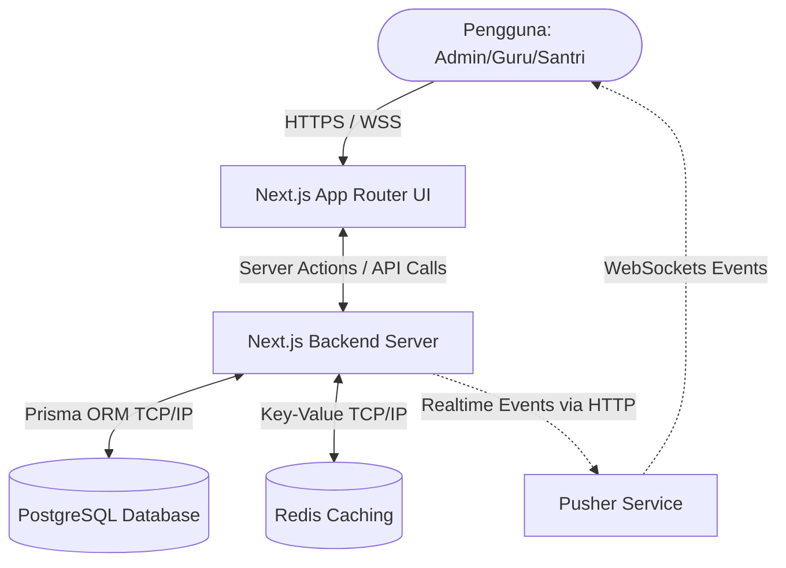
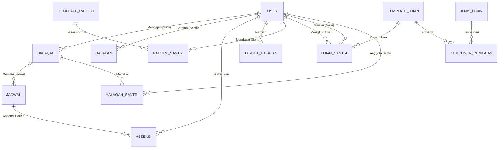
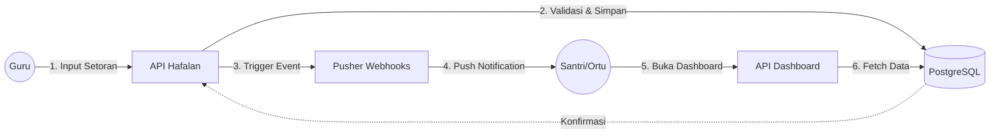
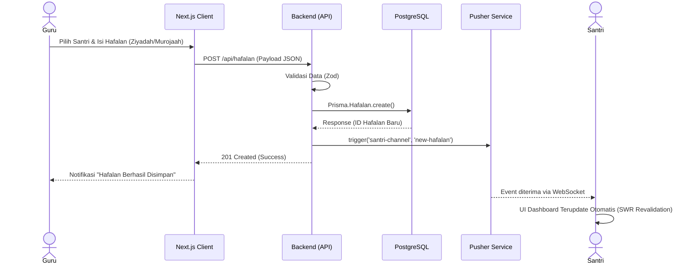
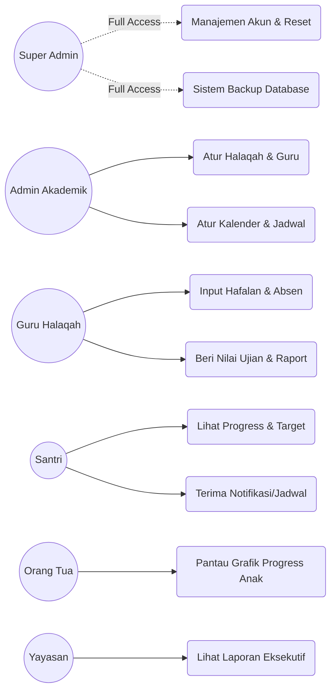
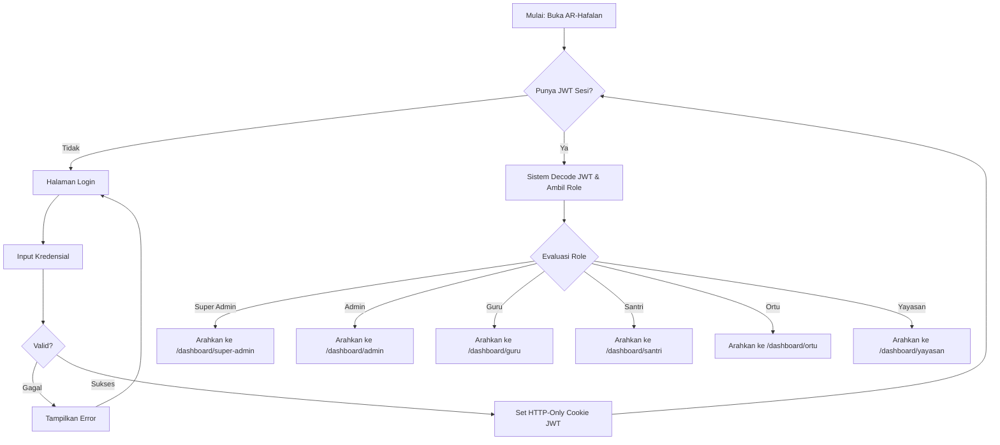
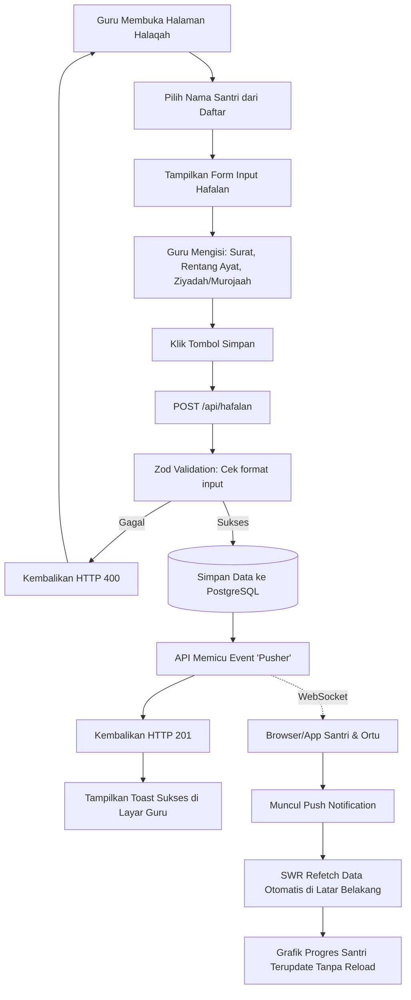
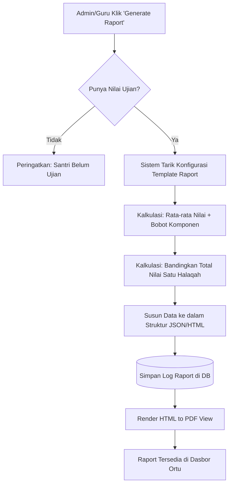

# Dokumentasi Komprehensif: AR-Hafalan

**AR-Hafalan** (Sistem Informasi Manajemen Hafalan Al-Quran) adalah aplikasi berbasis web yang dirancang khusus untuk memfasilitasi dan memonitoring kegiatan tahfidz di pondok pesantren atau lembaga pendidikan Islam. Dokumentasi ini mencakup keseluruhan aspek mulai dari desain UI/UX, fungsionalitas dan fitur, teknologi yang digunakan, hingga optimasi performa sistem.

---

## 1. UI/UX (User Interface & User Experience)

Pengalaman pengguna (UX) dan antarmuka (UI) dalam AR-Hafalan didesain untuk responsif, interaktif, dan memberikan umpan balik (feedback) seketika kepada penggunanya.

* **Zero-Layout Shift & Initial Page Load Instan:** Berkat implementasi Server-Side Rendering (SSR), HTML dikirim dari server sudah lengkap dengan data, menghindari tampilan yang melompat-lompat (*layout shift*) dan memangkas waktu *First Contentful Paint (FCP)* secara drastis menjadi hitungan milidetik.
* **Loading Skeletons (Suspense):** Perpindahan antar halaman memanfaatkan `loading.tsx` dari Next.js (Skeleton UI), sehingga pengguna tidak melihat layar kosong atau *spinner* yang membosankan saat memuat data. Hal ini membuat aplikasi terasa premium dan responsif.
* **Ant Design & Tailwind CSS:** Komponen UI dibangun dengan kombinasi Ant Design (untuk notifikasi, modal, dan elemen kompleks) dan Tailwind CSS (untuk styling layout yang fleksibel dan terstruktur).
* **Framer Motion:** Penggunaan animasi halus pada transisi elemen UI menggunakan library Framer Motion untuk memperkaya interaktivitas.
* **Responsive Design:** Tampilan dapat diakses dengan optimal melalui berbagai perangkat, mulai dari desktop, tablet, hingga *smartphone*.
* **Real-time Notifications:** Umpan balik langsung menggunakan *message notifications* saat pengguna melakukan aksi (seperti sukses input hafalan atau error validasi).

---

## 2. Fitur dan Fungsi (Berdasarkan Role Pengguna)

Sistem ini memiliki fitur lengkap berbasis *Role-Based Access Control (RBAC)* dengan 6 entitas pengguna utama:

### 👑 Super Admin (Kendali Penuh)
* **Manajemen Pengguna:** CRUD user dan reset password/passcode.
* **Manajemen Hak Akses:** Konfigurasi permission secara mendetail.
* **Database Backup:** Fitur otomatis (cron job) maupun manual untuk backup data PostgreSQL menggunakan *pg_dump* dengan retensi 30 hari.
* **Pengaturan & Dashboard Global:** Konfigurasi sistem dan pemantauan aktivitas seluruh entitas (Audit Logging & Login Activity).

### ⚙️ Admin (Operasional Akademik)
* **Manajemen Halaqah:** Pengaturan kelompok belajar, guru, dan santri.
* **Manajemen Tahun Akademik:** Konfigurasi kalender pendidikan, tahun ajaran, dan semester.
* **Template Ujian & Raport:** Pembuatan template penilaian dinamis untuk ujian tahfidz.
* **Jadwal & Pengumuman:** Distribusi informasi terpusat kepada seluruh entitas.
* **Laporan Global:** Analisis metrik kehadiran dan pencapaian target halaqah secara institusional.

### 👨‍🏫 Guru / Pembimbing (Interaksi Harian)
* **Dashboard Guru:** Statistik kelas dan ringkasan performa santri.
* **Input Interaktif:** Pencatatan absensi, setoran hafalan (Ziyadah & Murojaah), mutabaah yaumiyah.
* **Manajemen Target Hafalan:** Penetapan dan pelacakan target hafalan per santri berdasarkan batas waktu (deadline).
* **Penilaian Ujian & Raport:** Proses penginputan nilai dan pembuatan/cetak raport santri berkala.

### 🎓 Santri (Fokus Pembelajaran)
* **Dashboard Santri:** Ringkasan capaian hafalan dan jadwal terkini.
* **Progress Juz & Target:** Detail ayat yang telah disetorkan beserta visualisasi grafik.
* **Akses Evaluasi:** Melihat riwayat absensi, nilai ujian, dan hasil raport.
* **Notifikasi:** Pemberitahuan ujian, jadwal, atau pesan dari institusi.

### 👨‍👩‍👧‍👦 Orang Tua (Pemantauan Wali)
* **Multi-Child Monitoring:** Kemampuan memantau perkembangan lebih dari satu anak jika bersekolah di institusi yang sama.
* **Pemantauan Harian:** Melihat grafik hafalan anak, kehadiran, dan pengunduhan raport secara digital.
* **Informasi Real-time:** Notifikasi pengumuman dari admin/guru.

### 🏢 Yayasan (High-Level View)
* **Global Executive Dashboard:** Metrik utama operasional (persentase ketercapaian, jumlah santri aktif).
* **Laporan Komprehensif (Read-Only):** Melihat rekap tren hafalan dan rangkuman ujian guna bahan evaluasi kebijakan yayasan (menggunakan *Redis caching* untuk loading data yang berat).

---

## 3. Teknologi yang Digunakan (Tech Stack)

Aplikasi dibangun di atas pondasi teknologi web modern, memastikan skalabilitas, keamanan, dan *maintainability* (kemudahan perawatan).

* **Frontend & Backend Framework:** [Next.js 15](https://nextjs.org/) (App Router) & [React 19](https://react.dev/).
* **Bahasa Pemrograman:** [TypeScript](https://www.typescriptlang.org/) (Type-safe API endpoints dan komponen).
* **Styling & UI Library:** [Tailwind CSS 4](https://tailwindcss.com/), [Ant Design](https://ant.design/), dan [Radix UI](https://www.radix-ui.com/).
* **Database & ORM:** PostgreSQL terintegrasi dengan [Prisma ORM (v6.17.1)](https://www.prisma.io/).
* **Authentication & Keamanan:** [NextAuth.js](https://next-auth.js.org/) (JWT dengan HTTP-only cookies), `bcryptjs` untuk enkripsi, dan [Zod](https://zod.dev/) untuk validasi input.
* **Caching & State Management:** [Redis](https://redis.io/) (Data berat) dan [SWR](https://swr.vercel.app/) (Client-side data fetching/caching).
* **Real-time & Interaktivitas:** [Pusher](https://pusher.com/) untuk notifikasi real-time dan `framer-motion` untuk animasi.
* **Monitoring & Error Tracking:** [Sentry](https://sentry.io/) untuk pelacakan *bug* dan pemantauan performa produksi.
* **Utilitas Lainnya:** `date-fns` / `dayjs` (manipulasi waktu), `recharts` (pembuatan grafik visual).

---

## 4. Kinerja & Optimasi Performa (Performance)

Aplikasi telah melalui tahap optimalisasi tingkat *Production-Grade* untuk memastikan pengalaman tanpa hambatan:

### A. React Server Components (RSC)
Migrasi besar-besaran dari *Client-side data fetching* menjadi struktur **RSC** membuat beban *render* HTML berada di server.
* **Dampak:** Pengurangan *payload* JavaScript yang dikirim ke *browser* pengguna. *Network requests* menurun drastis hingga 60-80% pada akses pertama (sangat vital untuk Santri/Ortu yang menggunakan jaringan internet *mobile/slow connection*).

### B. Optimasi Kueri Database Terukur (Prisma)
* **Menghindari Memory Leaks:** Menghindari metode `include` mentah pada kueri relasional berskala besar (seperti mengambil data ribuan santri beserta absensinya).
* **Penggunaan `Select` & `Count` SQL:** Sistem menggunakan `select` spesifik kolom dan perhitungan jumlah (_count_) di tingkat database SQL, membebaskan RAM server (seperti Vercel) dari risiko *bottleneck*.

### C. Strategi Caching (On-Demand Revalidation)
* Penggunaan `unstable_cache` untuk data referensi statis (contoh: Tahun Akademik, Template Ujian).
* Sistem melakukan pembaruan otomatis *(background refresh)* menggunakan `revalidateTag()` hanya jika terjadi perubahan (mutasi) data. Dalam kondisi *cache* yang aktif (Hit), *response time* API ditargetkan dapat mencapai latensi yang sangat rendah (berkisar 50ms) untuk pemuatan data-data utama.
* **Redis Caching** secara khusus diterapkan untuk agregasi data berat pada halaman Yayasan agar tidak membebani database utama saat generate laporan skala institusi.

### D. Keamanan & PWA Readiness
* Semua *input/payload* divalidasi ketat dengan **Zod** sebelum diproses.
* Meskipun menggunakan *Server Components*, rute REST API di `/api/*` tetap dijaga sebagai fondasi **Progressive Web App (PWA)** atau jika sistem ingin di-ekspansi menjadi aplikasi *Native* (Android/iOS) dengan *Service Workers* (Offline Mode) ke depannya.

---

## 5. Arsitektur Sistem (C4 Model - Container Level)

Diagram arsitektur tingkat kontainer (Container Diagram) menggambarkan bagaimana aplikasi berinteraksi secara internal antara *frontend*, *backend*, dan layanan pihak ketiga.



---

## 6. Entity Relationship Diagram (ERD)

Struktur relasi *database* utama (disederhanakan dari schema Prisma) yang mengatur penyimpanan data inti aplikasi:



---

## 7. Data Flow Diagram (DFD)

Aliran data (*Data Flow*) yang menunjukkan interaksi dari Input (Guru) menuju Output (Layar Santri) pada fungsi setoran hafalan.



---

## 8. Sequence Diagram (Alur Input Hafalan)

Diagram urutan (*Sequence*) spesifik mengenai bagaimana data setoran hafalan mengalir hingga notifikasi waktu-nyata (*real-time*) diterima santri.



---

## 9. Use Case Diagram

Gambaran hak akses dan tindakan apa saja yang dapat dilakukan oleh tiap aktor (Role) di dalam sistem:



---

## 10. Struktur Folder Proyek

Penjelasan tanggung jawab tiap direktori utama di dalam repositori source code:

```text
/AR_update
├── /app                # Rute Next.js App Router (Halaman & Backend API)
│   ├── /api            # Backend endpoint (REST, Webhooks)
│   ├── /(auth)         # Halaman otentikasi (Login/Lupa Password)
│   └── /(dashboard)    # Halaman UI terproteksi sesuai Role (Admin/Guru/Santri)
├── /components         # Komponen UI Reusable
│   ├── /ui             # Komponen dasar (Tombol, Input, Modal via AntD/Radix)
│   └── /forms          # Komponen Formulir Kompleks
├── /constants          # Variabel statis, Konfigurasi Navigasi, dll.
├── /hooks              # Custom React Hooks (SWR Fetcher, Auth Hooks)
├── /lib                # Utilitas Core (Konfigurasi Prisma, NextAuth, Format Date)
├── /prisma             # Konfigurasi Database (schema.prisma, seeders, migrations)
├── /public             # Aset Statis (Logo, Favicon, Gambar Default)
├── /scripts            # Skrip Utilitas (Backup cron-job, Migrasi manual)
├── /types              # Definisi TypeScript Interfaces & Zod Validation Schemas
└── /utils              # Fungsi Helper (Konversi String, Helper Kalkulasi Nilai)
```

---

## 11. Dokumentasi API Kunci

Sebagian besar komunikasi data berjalan via rute internal, namun berikut adalah spesifikasi endpoint krusial di sistem:

| Endpoint | Method | Role | Keterangan | Validasi (Zod) |
|----------|--------|------|------------|----------------|
| `/api/auth/login` | POST | Publik | Memvalidasi *username* & kata sandi, mengembalikan JWT (HTTP-Only). | `username`, `password` |
| `/api/hafalan` | POST | Guru | Memasukkan catatan hafalan (surat, ayat, jenis) santri. | `santriId`, `tanggal`, `surat`, dll. |
| `/api/hafalan` | GET | Santri/Guru | Mengambil riwayat hafalan santri (mendukung parameter paginasi). | - |
| `/api/raport/generate` | POST | Guru/Admin | Melakukan komputasi *average* dari nilai ujian menjadi raport final. | `santriId`, `tahunAjaranId` |
| `/api/users/reset` | PUT | SuperAdmin | Me-*reset* passcode akses jika pengguna lupa sandi (lupa akses). | `userId`, `newPasscode` |

*Semua endpoint mewajibkan Header `Cookie` berisikan sesi JWT valid dari NextAuth, dan akan membalas HTTP `401 Unauthorized` / `403 Forbidden` jika pengguna salah/tidak berhak.*

---

## 12. Strategi Keamanan (Security)

Untuk menjamin kerahasiaan dan integritas data pengguna (Santri dan Lembaga), aplikasi menerapkan standar keamanan:
* **JSON Web Token (JWT) + HTTP-Only Cookies:** Menggunakan konfigurasi NextAuth dengan strategi sesi JWT (`session.strategy: "jwt"`), autentikasi disalurkan lewat *HTTP-Only cookies* yang tidak dapat dibaca oleh *JavaScript browser* guna menangkal pencurian sesi (*Session Hijacking*).
* **Cross-Site Scripting (XSS) Protection:** Perlindungan XSS utamanya ditangani oleh fitur *escaping* bawaan React (Server Components) pada saat *rendering* HTML. Sedangkan **Zod** berfungsi secara khusus untuk memvalidasi struktur dan tipe data input pengguna secara ketat sebelum mencapai *database*, bukan sebagai perlindungan XSS langsung.
* **Cross-Site Request Forgery (CSRF) Tokens:** Modul perlindungan NextAuth secara *default* sudah menyuntikkan token pencegah di setiap formulir vital (seperti aksi Login/Logout).
* **RBAC API Protection:** Sistem pengecekan tipe peran disisipkan di dalam kode rute, (`if (user.role !== 'SUPER_ADMIN') return 403`).
* **Rate Limiting:** Menggunakan pembatasan panggilan API untuk menghindari percobaan *Brute Force* (khususnya pada *login* dan *forgot passcode*).

---

## 13. Strategi Deployment, CI/CD, dan Backup

Infrastruktur dan kelangsungan operasional dijaga dengan pola berikut:
* **Deployment Aplikasi:** Dirancang *stateless* untuk dideploy dengan mulus (*seamless deploy*) di ekosistem platform-as-a-service (PaaS) seperti **Vercel** atau VPS standar.
* **Continuous Integration (CI/CD):** Penggunaan *GitHub Actions* (atau sistem serupa) untuk mem-validasi `eslint`, `tsc --noEmit` (TypeScript Checks), dan build statis. Menutup penolakan fitur jika *build* gagal.
* **Backup Strategy (Disaster Recovery):** Terpadu modul `npm run backup:cron` menggunakan instrumen `pg_dump`. Skrip ini dieksekusi secara periodik (Crontab tiap jam 02:00 dini hari), menyalin *snapshot* database ke direktori aman dengan *retensi hapus-otomatis* (auto-cleanup) setiap 30 hari.

---

## 14. Strategi Testing (Pengujian Sistem)

Guna mempertahankan stabilitas kode tanpa jeda di fase operasional jangka panjang:
* **Unit Testing (Vitest/Jest):** Ditujukan untuk menguji utilitas, logika perhitungan kalkulasi nilai rapor, dan konversi kurva ujian yang kompleks.
* **Integration Testing:** Memastikan interaksi spesifik rute API (`/api/hafalan`) merespons dengan struktur DB *Prisma* secara konsisten.
* **End-to-End (E2E) Testing (Playwright / Cypress):** Mensimulasikan pengguna aktual mulai dari mengisi halaman masuk (Login), memilih halaqah di Dasbor, sampai tombol *Submit* hafalan terklik, memitigasi kemungkinan *breaking UI changes*.
* **Load Testing:** Karena *event trigger* *Pusher* dapat memuncak saat ribuan pengguna membuka Dasbor serentak, performa *bottleneck* harus diuji secara khusus di area relasi banyak santri. (Tertangani dengan teknik RSC dan *Redis Cache* yang diterapkan).

---

## 15. Bisnis Proses (Business Process) Terperinci

Sistem AR-Hafalan dirancang untuk mendigitalkan seluruh ekosistem tahfidz secara komprehensif. Berikut adalah rincian tahapan bisnis proses yang saling berkesinambungan:

### A. Tahap Inisialisasi & Setup Akademik (Admin)
1. **Pembuatan Tahun Ajaran & Semester:** Admin membuat periode akademik aktif (misal: 2026/2027 Semester Ganjil).
2. **Manajemen Template:** Admin mendefinisikan *Template Ujian* (seperti UTS, UAS, Tasmi') beserta *Komponen Penilaian* (Tajwid, Kelancaran, Fasohah) dan proporsi bobotnya. Admin juga membuat *Template Raport*.
3. **Pembentukan Halaqah:** Admin membuat grup kelas (Halaqah), menetapkan satu Guru Pembimbing (Atau lebih dengan fitur *Guru Permission*), lalu memasukkan daftar Santri ke dalamnya.

### B. Tahap Pembelajaran & Pemantauan Harian (Guru & Santri)
1. **Penetapan Target:** Di awal periode, Guru menugaskan *Target Hafalan* kepada masing-masing Santri dengan batas waktu penyelesaian (*deadline*).
2. **Setoran Harian:** Santri berhadapan dengan Guru. Guru membuka aplikasi, memilih nama santri, lalu menginput kehadiran (Absensi) dan hasil setoran (Ziyadah/Murojaah, rentang surat & ayat).
3. **Notifikasi *Real-Time*:** Begitu data disimpan, sistem langsung mengirim *push notification* via *WebSockets* (Pusher) ke *smartphone* Santri dan Orang Tua bahwa setoran hari ini telah dicatat.
4. **Pemantauan Mandiri:** Santri atau Orang Tua dapat membuka Dasbor Klien kapan saja untuk melihat persentase pencapaian hafalan terhadap target yang diberikan.

### C. Tahap Evaluasi & Ujian (Guru & Admin)
1. **Pendaftaran Ujian:** Guru memilih Santri yang sudah memenuhi syarat untuk diuji (misal: selesai 1 juz).
2. **Pelaksanaan Ujian:** Guru melakukan penilaian *live* berdasarkan indikator (Tajwid, Kelancaran) dari *Template Ujian* yang sudah disiapkan Admin.
3. **Kalkulasi & Verifikasi:** Sistem mengakumulasi bobot nilai. Admin (atau Verifikator) dapat meninjau (verifikasi) hasil ujian sebelum disahkan.

### D. Tahap Pelaporan & Raport (Sistem & Yayasan)
1. **Generate Raport:** Pada akhir semester, Guru memicu sistem untuk menghitung nilai rata-rata dari seluruh ujian, mengalkulasi peringkat kelas (*ranking*), dan menerbitkan berkas *Raport Digital* (PDF).
2. **Tinjauan Eksekutif:** Pihak Yayasan membuka Dasbor Global untuk melihat rekapitulasi statistik lembaga (berapa persen santri yang mencapai target, performa guru, dsb) sebagai bahan pengambilan keputusan manajemen.

---

## 16. Kumpulan Flowchart Sistem Berjalan

Untuk memperjelas gambaran teknis dari bisnis proses di atas, berikut adalah visualisasi alur sistem ke dalam beberapa bagian krusial:

### Flowchart 1: Alur Autentikasi & Routing Berbasis Peran
Menjelaskan bagaimana sistem menyortir akses pengguna ke dasbor yang relevan sesaat setelah proses *login*.



### Flowchart 2: Alur Spesifik Setoran Hafalan & Notifikasi
Menjelaskan secara mendalam bagaimana satu proses harian (setoran) dieksekusi dari sisi Guru hingga dampaknya ke Santri.



### Flowchart 3: Alur Pembuatan & Cetak Raport
Menjelaskan komputasi akhir yang mengubah data mentah ujian menjadi berkas lapor akademik.


