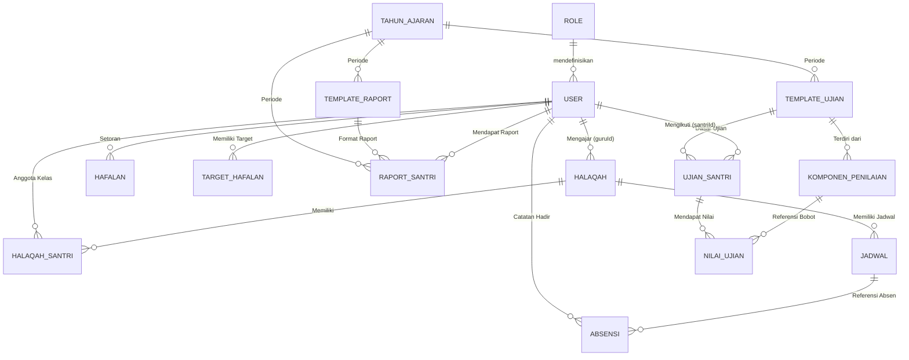
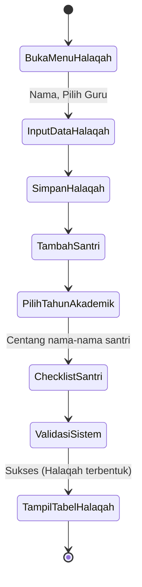
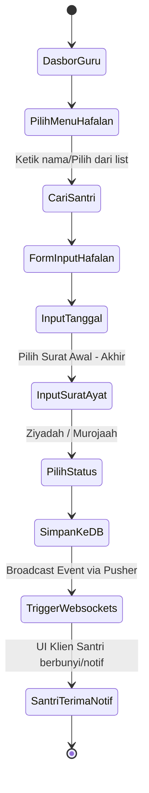
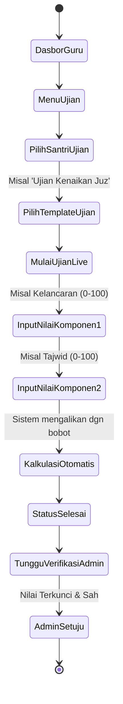
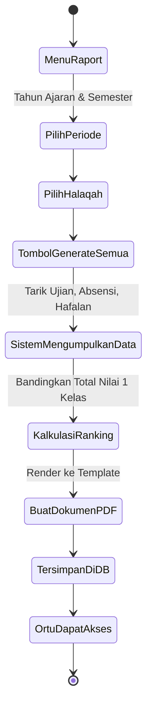
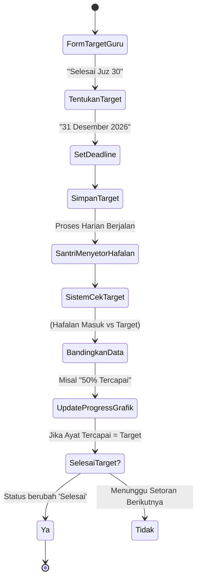

# Arsitektur Database & Diagram Aktivitas Sistem AR-Hafalan

Dokumen ini memuat penjabaran mendalam mengenai relasi antar tabel (Database Prisma) dan visualisasi aktivitas spesifik (*Use Case* & *Activity Diagram*) untuk setiap fitur utama di sistem AR-Hafalan.

---

## 1. Penjelasan Relasi Database Prisma (Database Schema)

Sistem AR-Hafalan mengandalkan PostgreSQL dengan Prisma ORM. Struktur *database*-nya sangat relasional (RDBMS) untuk memastikan integritas data akademik.

### Relasi Kunci (Key Relationships):

1. **User (Pengguna) & Role:**
   - Tabel `User` memiliki satu `Role` (Relasi 1-ke-1).
   - Tabel `User` sangat dinamis: Bisa bertindak sebagai Guru, Santri, Orang Tua, Admin, dsb.

2. **Halaqah (Grup Kelas) & Santri:**
   - Relasi *Many-to-Many* melalui tabel *Pivot* `HalaqahSantri`.
   - Sebuah `Halaqah` memiliki satu Guru utama (`guruId` merujuk ke `User`).
   - Tabel `HalaqahSantri` mencatat riwayat masuknya Santri ke Halaqah pada suatu `TahunAkademik` dan `Semester`.

3. **Jadwal & Absensi:**
   - `Halaqah` memiliki banyak `Jadwal` (1-ke-Banyak).
   - `Absensi` terkait langsung dengan `Jadwal` spesifik dan `Santri` spesifik. Memastikan tidak ada absensi tanpa jadwal yang terdaftar.

4. **Hafalan & Target:**
   - `Santri` (User) memiliki banyak riwayat `Hafalan` (Relasi 1-ke-Banyak).
   - `TargetHafalan` berdiri secara terpisah untuk setiap Santri, berisi tenggat waktu (*deadline*) dan status tercapai atau belum.

5. **Sistem Penilaian (Ujian & Raport):**
   - **Template:** Terdapat `TemplateUjian` yang memiliki banyak `KomponenPenilaian` (misal: Tajwid 40%, Fasohah 60%).
   - **Transaksi:** Saat ujian, dibuat `UjianSantri` yang merujuk pada `TemplateUjian`. Rincian nilainya disimpan di `NilaiUjian` yang menunjuk ke `KomponenPenilaian`.
   - **Raport Akhir:** Data ujian dikalkulasi lalu direkam abadi di tabel `RaportSantri` beserta tautan file PDF dan grafiknya.

---

## 2. Entity Relationship Diagram (ERD) Komprehensif

Berikut adalah gambaran tabel dan kardinalitas sistem (menggunakan *Crow's Foot Notation*):



---

## 3. Diagram Aktivitas & Use Case Tiap Fitur

### A. Fitur Manajemen Halaqah & Tahun Ajaran
**Penanggung Jawab (Aktor):** Admin

**Use Case:**
```mermaid
usecaseDiagram
    actor Admin
    Admin --> (Buat Tahun Ajaran & Semester)
    Admin --> (Buat Halaqah Baru)
    Admin --> (Tetapkan Guru ke Halaqah)
    Admin --> (Masukkan Daftar Santri ke Halaqah)
    Admin --> (Atur Jadwal Halaqah)
```

**Activity Diagram (Alur Pembentukan Halaqah):**


---

### B. Fitur Input Setoran Hafalan (Ziyadah/Murojaah)
**Penanggung Jawab (Aktor):** Guru, Santri (Penerima)

**Use Case:**
```mermaid
usecaseDiagram
    actor Guru
    actor Santri
    Guru --> (Pilih Santri)
    Guru --> (Isi Rentang Ayat & Surat)
    Guru --> (Tandai Status: Ziyadah/Murojaah)
    Guru --> (Beri Keterangan Opsional)
    (Terima Notifikasi Push) <-- Santri
    (Lihat Grafik Hafalan Terupdate) <-- Santri
```

**Activity Diagram:**


---

### C. Fitur Pelaksanaan Ujian Tahfidz
**Penanggung Jawab (Aktor):** Guru, Admin (Verifikator)

**Use Case:**
```mermaid
usecaseDiagram
    actor Guru
    actor Admin
    Guru --> (Mulai Ujian Santri)
    Guru --> (Input Nilai per Komponen)
    Guru --> (Simpan sebagai Draft/Selesai)
    (Verifikasi Hasil Ujian) <-- Admin
```

**Activity Diagram:**


---

### D. Fitur Generate & Cetak Raport
**Penanggung Jawab (Aktor):** Guru/Admin, Orang Tua (Pembaca)

**Use Case:**
```mermaid
usecaseDiagram
    actor Admin
    actor Guru
    actor Ortu
    Admin --> (Buat Template Raport)
    Guru --> (Klik Generate Raport Kelas)
    Guru --> (Beri Catatan Akhir Wali Kelas)
    (Lihat & Download PDF Raport) <-- Ortu
```

**Activity Diagram:**


---

### E. Fitur Target Hafalan & Pemantauan
**Penanggung Jawab (Aktor):** Guru, Santri

**Activity Diagram:**

