# Dokumentasi Lengkap Sistem AR-Hafalan

**AR-Hafalan** — Sistem Informasi Manajemen Hafalan Al-Quran untuk Pondok Pesantren / Lembaga Pendidikan Islam.

---

## Daftar Isi

1. [Bisnis Proses Sistem](#1-bisnis-proses-sistem)
   - 1.1 Manajemen Pengguna (Super Admin)
   - 1.2 Manajemen Role & Permission
   - 1.3 Manajemen Tahun Akademik
   - 1.4 Manajemen Halaqah
   - 1.5 Manajemen Jadwal Halaqah
   - 1.6 Manajemen Santri dalam Halaqah
   - 1.7 Manajemen Absensi (Kehadiran)
   - 1.8 Manajemen Hafalan (Ziyadah & Murojaah)
   - 1.9 Manajemen Target Hafalan
   - 1.10 Manajemen Ujian & Penilaian
   - 1.11 Manajemen Raport
   - 1.12 Manajemen Pengumuman
   - 1.13 Manajemen Notifikasi
   - 1.14 Manajemen Prestasi Santri
   - 1.15 Sistem Backup Database
   - 1.16 Lupa Passcode & Reset
   - 1.17 Integrasi WhatsApp Notification
   - 1.18 Cross-Halaqah Guru Permission
   - 1.19 Template Ujian & Raport
   - 1.20 Laporan & Analytics
   - 1.21 Sistem Konversi Hafalan ke Progress Juz
   - 1.22 Sistem Autentikasi & Keamanan
2. [Entity Relationship Diagram (ERD)](#2-entity-relationship-diagram-erd)
3. [Activity Diagram per Role](#3-activity-diagram-per-role)
4. [Use Case Diagram per Role](#4-use-case-diagram-per-role)

---

## 1. Bisnis Proses Sistem

### 1.1 Manajemen Pengguna (Super Admin)

**Deskripsi:**
Super Admin memiliki wewenang penuh atas seluruh data pengguna di sistem. Fitur ini mencakup pembuatan akun baru, pengeditan data, penghapusan, serta reset kredensial (passcode) untuk semua role pengguna.

**Aktor:** Super Admin

**Fungsi:**
- `GET /api/users` — Melihat daftar seluruh pengguna dengan filter role
- `POST /api/users` — Membuat pengguna baru (username, nama, passcode, role, no telepon, alamat, email)
- `GET /api/users/[id]` — Detail pengguna
- `PUT /api/users/[id]` — Edit data pengguna
- `DELETE /api/users/[id]` — Hapus pengguna
- `GET /api/users/check-passcode` — Cek ketersediaan passcode

**Aturan Bisnis:**
1. Username harus unik di seluruh sistem
2. Passcode bersifat alfanumerik (6-10 karakter)
3. Saat reset passcode, pengguna tidak bisa menggunakan passcode yang sama dengan yang lama
4. Super Admin tidak bisa menghapus akun sendiri
5. Setiap perubahan pengguna dicatat di AuditLog
6. Role tidak bisa diubah jika pengguna sudah memiliki data transaksional (hafalan, absensi)
7. Nomor telepon harus valid untuk menerima notifikasi WhatsApp

---

### 1.2 Manajemen Role & Permission

**Deskripsi:**
Sistem memiliki 6 role pengguna dengan hierarki permission. Super Admin dapat mengonfigurasi permission untuk setiap role secara detail.

**Role & Level:**
| Role | Level | Akses |
|------|-------|-------|
| super_admin | 6 | Full akses seluruh sistem |
| admin | 5 | Manajemen akademik & operasional |
| guru | 3 | Input data santri, hafalan, absensi, ujian |
| santri | 4 | View-only data diri sendiri |
| ortu | 2 | View-only data anak |
| yayasan | 1 | View-only laporan eksekutif |

**Aktor:** Super Admin

**Fungsi:**
- `GET /api/roles` — Daftar role
- `GET /api/roles/permissions` — Daftar permission tersedia
- `PUT /api/roles/[id]` — Update permission role

**Aturan Bisnis:**
1. Super Admin tidak bisa diturunkan levelnya
2. Permission bersifat additive (menambah, tidak mengurangi akses bawaan role)
3. Setiap perubahan permission dicatat di AuditLog
4. Role santri dan ortu bersifat read-only dan tidak bisa diberikan akses tulis

---

### 1.3 Manajemen Tahun Akademik

**Deskripsi:**
Sistem menggunakan tahun akademik sebagai periode utama untuk mengelompokkan data pendidikan. Setiap tahun akademik memiliki dua semester.

**Aktor:** Admin

**Fungsi:**
- `GET /api/admin/tahun-akademik` — Daftar tahun akademik
- `POST /api/admin/tahun-akademik` — Buat tahun akademik baru
- `GET /api/admin/tahun-akademik/active` — Ambil tahun akademik aktif
- `POST /api/admin/tahun-akademik/active` — Set tahun akademik aktif
- `POST /api/admin/tahun-akademik/auto-generate` — Generate otomatis

**Aturan Bisnis:**
1. Semester 1 (S1): Juli - Desember (tahun akademik YYYY/YYYY+1)
2. Semester 2 (S2): Januari - Juni (tahun akademik YYYY-1/YYYY)
3. Hanya satu tahun akademik yang bisa aktif dalam satu waktu
4. Data HalaqahSantri, UjianSantri, RaportSantri, TemplateUjian, TemplateRaport terikat pada tahun akademik
5. Tahun akademik bisa digenerate otomatis berdasarkan tanggal saat ini
6. Tahun akademik yang sudah memiliki data transaksional tidak bisa dihapus

---

### 1.4 Manajemen Halaqah

**Deskripsi:**
Halaqah adalah kelompok belajar tahfidz yang terdiri dari satu Guru Pembimbing dan beberapa Santri. Setiap halaqah memiliki jadwal rutin.

**Aktor:** Admin

**Fungsi:**
- `GET /api/admin/halaqah` — Daftar halaqah
- `POST /api/admin/halaqah` — Buat halaqah baru
- `GET /api/halaqah/[id]` — Detail halaqah
- `POST /api/admin/sync/halaqah` — Sinkronisasi data halaqah

**Aturan Bisnis:**
1. Satu halaqah minimal memiliki 5 santri (validasi di halaqah-logger.ts)
2. Satu halaqah harus memiliki seorang Guru (guruId wajib)
3. Satu Guru bisa mengajar di beberapa halaqah
4. Satu Santri hanya bisa berada di satu halaqah dalam satu tahun akademik
5. Nama halaqah harus unik dalam satu tahun akademik
6. Perubahan data halaqah dicatat di AuditLog

---

### 1.5 Manajemen Jadwal Halaqah

**Deskripsi:**
Setiap halaqah memiliki jadwal pertemuan rutin yang menentukan hari dan jam kegiatan.

**Aktor:** Admin

**Fungsi:**
- `GET /api/jadwal` — Daftar jadwal
- `POST /api/jadwal` — Buat jadwal baru

**Aturan Bisnis:**
1. Jadwal terdiri dari: hari (Senin-Minggu), jam mulai, jam selesai
2. Jadwal bisa berupa template (berulang setiap minggu) atau spesifik (tanggal tertentu)
3. Satu halaqah bisa memiliki banyak jadwal dalam seminggu
4. `isActive` = false menandakan jadwal tidak aktif
5. `isTemplate` = true menandakan jadwal berlaku setiap minggu
6. Dua jadwal dalam halaqah yang sama tidak boleh bertabrakan waktunya di hari yang sama
7. Absensi hanya bisa diinput berdasarkan jadwal yang aktif

---

### 1.6 Manajemen Santri dalam Halaqah

**Deskripsi:**
Santri ditempatkan ke dalam halaqah melalui tabel pivot HalaqahSantri yang terikat tahun akademik dan semester.

**Aktor:** Admin

**Fungsi:**
- `GET /api/admin/assigned-santris` — Santri yang sudah terdaftar
- `POST /api/admin/halaqah` — Assign/remove santri dari halaqah

**Aturan Bisnis:**
1. Pencatatan relasi Santri-Halaqah menggunakan `tahunAkademik` dan `semester`
2. Satu Santri hanya bisa berada di satu halaqah dalam satu semester
3. Santri bisa dipindahkan halaqah antar semester
4. Data historis santri di halaqah lama tetap tersimpan
5. Guru hanya bisa mengakses santri di halaqah-nya sendiri (kecuali dapat cross-permission)

---

### 1.7 Manajemen Absensi (Kehadiran)

**Deskripsi:**
Guru mencatat kehadiran santri setiap kali pertemuan. Status kehadiran: Masuk, Izin, Alpha.

**Aktor:** Guru

**Fungsi:**
- `GET /api/guru/absensi` — Data absensi per tanggal
- `POST /api/guru/absensi` — Simpan absensi (batch per halaqah)

**Aturan Bisnis:**
1. Status absensi: `masuk` (hadir), `izin` (izin), `alpha` (tanpa keterangan)
2. Absensi hanya bisa diinput untuk hari ini atau sebelumnya (tidak bisa masa depan)
3. Absensi terikat pada jadwal (jadwalId) dan santri (santriId)
4. Tidak bisa double input absensi untuk santri yang sama di jadwal dan tanggal yang sama
5. Guru hanya bisa menginput absensi untuk santri di halaqah-nya sendiri
6. Setelah jam terakhir jadwal, sistem bisa mengirim WhatsApp recap harian
7. Orang Tua mendapat notifikasi otomatis jika anaknya alpha

---

### 1.8 Manajemen Hafalan (Ziyadah & Murojaah)

**Deskripsi:**
Guru mencatat setoran hafalan santri yang terdiri dari surat, rentang ayat, dan jenis hafalan.

**Aktor:** Guru

**Fungsi:**
- `GET /api/guru/hafalan` — Riwayat hafalan
- `POST /api/guru/hafalan` — Input hafalan baru

**Aturan Bisnis:**
1. Dua jenis hafalan: `ziyadah` (tambahan baru) dan `murojaah` (mengulang)
2. Setiap record mencakup: surat, ayatMulai, ayatSelesai, tanggal
3. Rentang ayat harus valid: ayatMulai <= ayatSelesai
4. Surat harus valid dalam daftar 114 surat Al-Quran
5. Input hafalan hanya bisa dilakukan Guru terhadap santri di halaqah-nya
6. Setelah tersimpan, sistem mengirim notifikasi real-time (Pusher) ke Santri & Ortu
7. WhatsApp notification dikirim ke Orang Tua saat hafalan dicatat
8. Data hafalan digunakan untuk kalkulasi progress juz

---

### 1.9 Manajemen Target Hafalan

**Deskripsi:**
Guru menetapkan target hafalan untuk setiap santri dengan batas waktu (deadline). Progress target dipantau secara otomatis.

**Aktor:** Guru

**Fungsi:**
- `GET /api/guru/target` — Daftar target
- `POST /api/guru/target` — Buat target baru
- `GET /api/target/[id]` — Detail target

**Aturan Bisnis:**
1. Tiga status target: `belum` (belum dimulai), `proses` (sedang dikerjakan), `selesai` (tuntas)
2. Target mencakup surat, ayatTarget, dan deadline
3. Sistem otomatis membandingkan total ayat hafalan vs target untuk update progress
4. WhatsApp notification ke Orang Tua saat target dibuat, selesai, atau dihapus
5. Target tidak bisa diubah statusnya manual; sistem yang menentukan via kalkulasi
6. Deadline yang terlewat otomatis menandai target sebagai gagal (jika ada mekanisme)
7. Grafik progress target ditampilkan di dashboard santri & ortu

---

### 1.10 Manajemen Ujian & Penilaian

**Deskripsi:**
Sistem ujian menggunakan template dengan komponen penilaian berbobot. Ujian melalui workflow verifikasi.

**Aktor:** Guru (input nilai), Admin (verifikasi)

**Fungsi:**
- `GET /api/guru/ujian` — Data ujian
- `POST /api/guru/ujian` — Input ujian baru
- `GET /api/guru/template-ujian` — Ambil template ujian
- `GET /api/guru/ujian/detailed` — Detail ujian per komponen

**Workflow Status Ujian:**
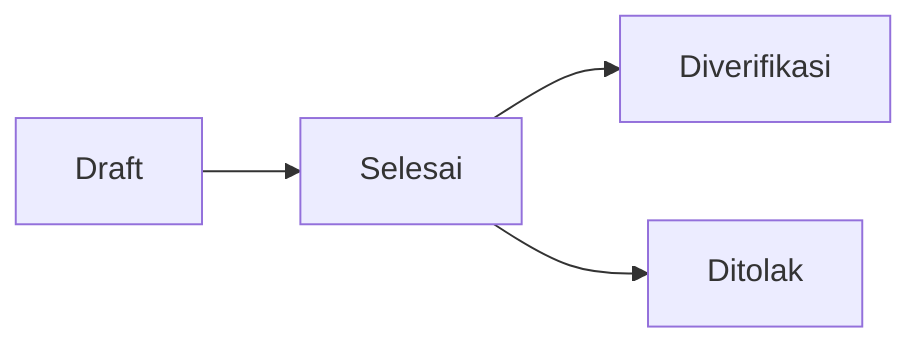

**Aturan Bisnis:**
1. Jenis ujian: tasmi', mhq, uas, kenaikan_juz, ujian_harian, ujian_tengah_semester, tahfidz
2. Setiap template ujian memiliki komponen penilaian dengan bobot (%), total bobot = 100%
3. Nilai Akhir = SUM(nilaiRaw * bobot / 100) untuk setiap komponen
4. Status ujian: draft -> selesai -> diverifikasi / ditolak
5. Admin bertindak sebagai verifikator untuk mengesahkan atau menolak ujian
6. WhatsApp notification ke Orang Tua saat ujian diverifikasi
7. Ujian yang diverifikasi tidak bisa diubah lagi
8. Ujian ditolak bisa direvisi oleh Guru

---

### 1.11 Manajemen Raport

**Deskripsi:**
Raport dihasilkan dari kalkulasi nilai ujian santri dalam satu periode. Raport bisa diunduh dalam format PDF.

**Aktor:** Guru (generate), Admin (template), Ortu/Santri (lihat)

**Fungsi:**
- `POST /api/guru/raport` — Generate raport
- `GET /api/raport` — Lihat raport
- `GET /api/admin/download-raport` — Download PDF raport
- `GET /api/admin/download-raport-batch` — Download batch raport
- `GET/api/admin/template-raport` — CRUD template raport

**Aturan Bisnis:**
1. Raport menggunakan template yang berisi: kop surat, logo, format tabel, grafik, ranking
2. Nilai rata-rata dihitung dari seluruh ujian santri di periode tersebut
3. Ranking dihitung per halaqah (membandingkan total nilai akhir santri dalam satu halaqah)
4. Satu santri hanya memiliki satu raport per tahun akademik (unique constraint)
5. Grafik data disimpan dalam format JSON
6. File PDF raport disimpan di server dan bisa diunduh kapan saja
7. Ortu bisa melihat raport semua anaknya
8. Yayasan bisa melihat raport seluruh santri

---

### 1.12 Manajemen Pengumuman

**Deskripsi:**
Admin dapat membuat pengumuman yang ditargetkan ke role tertentu. Sistem melacak status baca pengumuman.

**Aktor:** Admin

**Fungsi:**
- `GET /api/pengumuman` — Daftar pengumuman
- `POST /api/pengumuman` — Buat pengumuman baru
- `GET /api/pengumuman/latest` — Pengumuman terbaru
- `PUT /api/pengumuman/[id]` — Edit pengumuman
- `DELETE /api/pengumuman/[id]` — Hapus pengumuman

**Aturan Bisnis:**
1. Target audience: `semua`, `guru`, `santri`, `admin`, `ortu`, `yayasan`, `super_admin`
2. Pengumuman memiliki tanggal kadaluarsa (tanggalKadaluarsa)
3. Setelah kadaluarsa, pengumuman tidak muncul lagi
4. Sistem melacak siapa saja yang sudah membaca (PengumumanRead)
5. Pengumuman dengan target `semua` atau `santri` otomatis juga dikirim ke Orang Tua
6. Pembuat pengumuman tercatat di createdBy
7. Notifikasi WhatsApp dikirim saat pengumuman baru diterbitkan

---

### 1.13 Manajemen Notifikasi

**Deskripsi:**
Sistem notifikasi internal yang mencatat semua aktivitas penting untuk setiap pengguna.

**Aktor:** Sistem (otomatis), Admin (manual)

**Fungsi:**
- `GET /api/notifikasi` — Daftar notifikasi user
- `POST /api/notifikasi` — Buat notifikasi
- `PUT /api/notifikasi/[id]` — Baca/tandai notifikasi

**Aturan Bisnis:**
1. Tipe notifikasi: `user`, `hafalan`, `rapot`, `absensi`, `pengumuman`
2. Notifikasi bersifat personal (per userId)
3. Notifikasi bisa dikirim via Pusher (real-time) dan WhatsApp
4. Notifikasi kadaluarsa otomatis setelah 30 hari

---

### 1.14 Manajemen Prestasi Santri

**Deskripsi:**
Mencatat pencapaian atau prestasi santri di bidang tahfidz maupun非-akademik.

**Aktor:** Guru

**Fungsi:**
- `GET /api/guru/prestasi` — Daftar prestasi
- `POST /api/guru/prestasi` — Catat prestasi baru

**Aturan Bisnis:**
1. Prestasi memiliki field: nama, kategori, tahun
2. Prestasi perlu divalidasi oleh Admin (`validated` = true)
3. WhatsApp notification ke Orang Tua saat prestasi dicatat
4. Prestasi yang sudah divalidasi tidak bisa dihapus

---

### 1.15 Sistem Backup Database

**Deskripsi:**
Backup otomatis dan manual database PostgreSQL untuk disaster recovery.

**Aktor:** Super Admin

**Fungsi:**
- `POST /api/admin/backup` — Backup manual
- `GET /api/cron/absensi-wa` — Cron job (30-day retention)

**Aturan Bisnis:**
1. Backup menggunakan pg_dump
2. Retensi 30 hari (backup lebih dari 30 hari otomatis dihapus)
3. File backup disimpan di direktori khusus
4. Riwayat backup dicatat di tabel Backup
5. Backup otomatis dijadwalkan setiap jam 02:00 via cron job

---

### 1.16 Lupa Passcode & Reset

**Deskripsi:**
Fitur pemulihan akses untuk pengguna yang lupa passcode. Menggunakan verifikasi via WhatsApp.

**Aktor:** Semua pengguna

**Fungsi:**
- `POST /api/forgot-passcode/request` — Request reset via WhatsApp
- `GET /api/admin/reset-password-requests` — Lihat permintaan reset (Admin)

**Aturan Bisnis:**
1. User mengirim permintaan reset via endpoint publik
2. Permintaan tercatat di tabel ForgotPasscode
3. Admin/Super Admin memproses permintaan reset
4. Rate limiting: 5 request/menit per IP
5. Passcode baru dikirimkan ke nomor telepon terdaftar via WhatsApp

---

### 1.17 Integrasi WhatsApp Notification

**Deskripsi:**
Sistem terintegrasi dengan FSN Gateway API untuk mengirim notifikasi WhatsApp ke Orang Tua dan pengguna.

**Aktor:** Sistem (otomatis)

**Fungsi:**
- `POST /api/admin-settings/whatsapp` — Konfigurasi WhatsApp API

**Event WhatsApp Notification:**
1. Hafalan baru dicatat → notifikasi ke Ortu
2. Target hafalan dibuat/selesai/dihapus → notifikasi ke Ortu
3. Ujian diverifikasi/diverifikasi → notifikasi ke Ortu
4. Prestasi dicatat → notifikasi ke Ortu
5. Pengumuman baru → notifikasi ke target audience
6. Rekap absensi harian → notifikasi ke Ortu

**Aturan Bisnis:**
1. Nomor telepon harus menggunakan format Indonesia (62xxx)
2. Konfigurasi API key tersimpan di SystemSetting
3. Pengiriman bersifat asynchronous (tidak blocking request utama)
4. Gagal kirim tidak mempengaruhi operasi utama

---

### 1.18 Cross-Halaqah Guru Permission

**Deskripsi:**
Admin dapat memberikan izin khusus kepada Guru untuk mengakses data santri di halaqah lain.

**Aktor:** Admin

**Fungsi:**
- `GET /api/admin/guru-permissions` — Daftar permission
- `POST /api/admin/guru-permissions` — Grant/revoke permission

**Aturan Bisnis:**
1. Tipe akses: canAbsensi, canHafalan, canTarget
2. Permission bersifat spesifik per guru dan per halaqah
3. Permission bisa diaktifkan/nonaktifkan (isActive)
4. Guru hanya bisa mengakses halaqah yang diizinkan
5. Log perubahan permission dicatat di AuditLog

---

### 1.19 Template Ujian & Raport

**Deskripsi:**
Admin membuat template standar untuk ujian dan raport yang digunakan oleh Guru.

**Aktor:** Admin

**Fungsi:**
- `GET /api/admin/template-ujian` — CRUD template ujian
- `GET /api/admin/template-raport` — CRUD template raport
- `GET /api/admin/jenis-ujian` — CRUD jenis ujian

**Aturan Bisnis:**
1. Template Ujian memiliki: nama, jenis ujian, tahun ajaran, komponen penilaian (bobot %)
2. Template Raport memiliki: logo, nama lembaga, format tabel, opsi grafik/ranking
3. Total bobot komponen penilaian harus 100%
4. Status template: `aktif`, `nonaktif`, `draft`
5. Template yang sudah digunakan tidak bisa dihapus
6. Setiap tahun ajaran bisa memiliki template berbeda

---

### 1.20 Laporan & Analytics

**Deskripsi:**
Sistem menyediakan berbagai laporan dan analitik untuk memantau kinerja institusi.

**Aktor:** Admin, Yayasan, Guru

**Fungsi:**
- `GET /api/analytics/dashboard` — Analitik dashboard global
- `GET /api/analytics/global-reports` — Laporan global institusi
- `GET /api/analytics/guru-dashboard` — Analitik dashboard guru
- `GET /api/analytics/ujian-reports` — Laporan ujian
- `GET /api/analytics/ujian-analytics` — Analitik ujian detail
- `GET /api/analytics/tahfidz-reports` — Laporan tahfidz
- `GET /api/analytics/santri-detail` — Detail analitik santri per individu
- `GET /api/admin/dashboard-stats` — Statistik dashboard admin

**Aturan Bisnis:**
1. Data laporan di-cache dengan Redis untuk performa
2. Laporan hanya menampilkan data tahun akademik aktif (default)
3. Yayasan hanya bisa melihat (read-only), tidak bisa mengunduh data mentah
4. Guru hanya melihat data halaqah-nya sendiri
5. Admin melihat data seluruh institusi
6. Cache di-revalidate saat ada mutasi data

---

### 1.21 Sistem Konversi Hafalan ke Progress Juz

**Deskripsi:**
Sistem mengonversi data hafalan (surat + ayat) menjadi progress per juz (1-30) untuk visualisasi.

**Aktor:** Sistem (otomatis)

**Fungsi:**
- `GET /api/konversi/progress-juz` — Progress juz santri
- `GET /api/konversi/target-surat` — Target per surat

**Aturan Bisnis:**
1. Mapping juz 1-30 sudah ditentukan secara pasti (juz-mapping.ts)
2. Setiap juz memiliki rentang surat:ayat yang tetap
3. Hafalan ziyadah dan murojaah diakumulasi untuk progress
4. Jika satu juz sudah penuh ayatnya disetor, juz dianggap selesai

---

### 1.22 Sistem Autentikasi & Keamanan

**Deskripsi:**
Sistem menggunakan JWT dengan HTTP-only cookies untuk autentikasi dan RBAC untuk otorisasi.

**Aktor:** Semua pengguna

**Alur:**
1. User memasukkan passcode di halaman login
2. Server memvalidasi kredensial, membuat JWT (24 jam masa berlaku)
3. JWT disimpan di HTTP-only cookie (secure, sameSite strict)
4. Setiap request ke halaman terproteksi dicek middleware
5. Middleware memverifikasi JWT dan role
6. Jika tidak valid/kedaluwarsa, redirect ke login

**Aturan Bisnis:**
1. Rate limiting: 5 request/menit untuk login
2. Lockout sementara setelah 10 percobaan gagal (30 detik, meningkat)
3. Lockout reset setelah 1 jam tidak ada aktivitas
4. Semua input API divalidasi dengan Zod
5. Session timeout: 24 jam
6. Passcode minimal 6 karakter, maksimal 10 karakter

---

## 2. Entity Relationship Diagram (ERD)

### Entity Relationship Diagram Lengkap

```mermaid
erDiagram
    %% ============ CORE ============
    ROLE ||--o{ USER : "memiliki"
    USER ||--o{ HALAQAH : "mengajar sebagai Guru (guruId)"
    USER ||--o{ HALAQAH_SANTRI : "terdaftar sebagai Santri"
    USER ||--o{ HAFALAN : "memiliki setoran"
    USER ||--o{ TARGET_HAFALAN : "memiliki target"
    USER ||--o{ ABSENSI : "memiliki kehadiran"
    USER ||--o{ PRESTASI : "memiliki prestasi"
    USER ||--o{ NOTIFIKASI : "menerima notifikasi"
    USER ||--o{ PENGUMUMAN_DIBUAT : "membuat pengumuman"
    USER ||--o{ PENGUMUMAN_DIBACA : "membaca pengumuman"
    USER ||--o{ UJIAN_SANTRI : "mengikuti ujian (santriId)"
    USER ||--o{ UJIAN_SANTRI_CREATED : "membuat ujian (createdBy)"
    USER ||--o{ UJIAN_SANTRI_VERIFIED : "memverifikasi ujian (diverifikasiBy)"
    USER ||--o{ RAPORT_SANTRI : "mendapat raport (santriId)"
    USER ||--o{ RAPORT_CREATED : "membuat raport (createdBy)"
    USER ||--o{ ORANG_TUA_SANTRI : "sebagai Orang Tua"
    USER ||--o{ SANTRI_DARI_ORTU : "sebagai Santri (anak)"
    USER ||--o{ GURU_PERMISSION : "sebagai Guru (guruId)"
    USER ||--o{ AUDIT_LOG : "mencatat aktivitas"
    USER ||--o{ FORGOT_PASSCODE : "meminta reset"
    USER ||--o{ TAHUN_AJARAN : "membuat tahun ajaran"
    USER ||--o{ JENIS_UJIAN : "membuat jenis ujian"
    USER ||--o{ KOMPONEN_PENILAIAN_JENIS : "membuat komponen penilaian jenis"
    USER ||--o{ TEMPLATE_UJIAN : "membuat template ujian"
    USER ||--o{ TEMPLATE_RAPORT : "membuat template raport"
    USER ||--o{ UJIAN_GURU : "sebagai Guru penilai (guruId)"
    USER ||--o{ UJIAN_GURU_SANTRI : "sebagai Santri dinilai (santriId)"

    %% ============ HALAQAH ============
    HALAQAH ||--o{ JADWAL : "memiliki jadwal"
    HALAQAH ||--o{ HALAQAH_SANTRI : "memiliki anggota"
    HALAQAH ||--o{ GURU_PERMISSION : "diakses guru lain"

    %% ============ PIVOT ============
    HALAQAH_SANTRI }o--|| TAHUN_AJARAN : "terikat periode"

    %% ============ JADWAL & ABSENSI ============
    JADWAL ||--o{ ABSENSI : "dasar absensi"

    %% ============ TAHUN AJARAN ============
    TAHUN_AJARAN ||--o{ TEMPLATE_UJIAN : "digunakan di"
    TAHUN_AJARAN ||--o{ TEMPLATE_RAPORT : "digunakan di"
    TAHUN_AJARAN ||--o{ UJIAN_SANTRI : "digunakan di"
    TAHUN_AJARAN ||--o{ RAPORT_SANTRI : "digunakan di"

    %% ============ UJIAN ============
    TEMPLATE_UJIAN ||--o{ KOMPONEN_PENILAIAN : "terdiri dari"
    TEMPLATE_UJIAN ||--o{ UJIAN_SANTRI : "dasar ujian"
    UJIAN_SANTRI ||--o{ NILAI_UJIAN : "memiliki nilai"
    KOMPONEN_PENILAIAN ||--o{ NILAI_UJIAN : "referensi bobot"

    %% ============ RAPORT ============
    TEMPLATE_RAPORT ||--o{ RAPORT_SANTRI : "format raport"

    %% ============ JENIS UJIAN ============
    JENIS_UJIAN ||--o{ KOMPONEN_PENILAIAN_JENIS : "terdiri dari"

    %% ============ PENGUMUMAN ============
    PENGUMUMAN ||--o{ PENGUMUMAN_DIBACA : "dibaca oleh"

    %% ============ ORANG TUA ============
    ORANG_TUA_SANTRI }o--|| USER : "orang tua"
    ORANG_TUA_SANTRI }o--|| USER : "santri"

    %% ============ ENTITY DEFINITIONS ============
    ROLE {
        int id PK
        string name UK
    }
    USER {
        int id PK
        string username UK
        string password
        string namaLengkap
        string passCode
        string noTlp
        string email
        string foto
        string alamat
        int roleId FK
        datetime createdAt
        datetime updatedAt
    }
    HALAQAH {
        int id PK
        string namaHalaqah
        int guruId FK
    }
    HALAQAH_SANTRI {
        int id PK
        int halaqahId FK
        int santriId FK
        string tahunAkademik
        semester semester
    }
    JADWAL {
        int id PK
        hari hari
        datetime jamMulai
        datetime jamSelesai
        int halaqahId FK
        boolean isActive
        boolean isTemplate
        datetime tanggalMulai
        datetime tanggalSelesai
    }
    ABSENSI {
        int id PK
        statusAbsensi status
        datetime tanggal
        int santriId FK
        int jadwalId FK
    }
    HAFALAN {
        int id PK
        datetime tanggal
        string surat
        int ayatMulai
        int ayatSelesai
        statusHafalan status
        string keterangan
        int santriId FK
    }
    TARGET_HAFALAN {
        int id PK
        string surat
        int ayatTarget
        datetime deadline
        statusTarget status
        int santriId FK
    }
    PRESTASI {
        int id PK
        string namaPrestasi
        string keterangan
        string kategori
        int tahun
        int santriId FK
        boolean validated
    }
    TEMPLATE_UJIAN {
        int id PK
        string namaTemplate
        jenisUjianTemplate jenisUjian
        string deskripsi
        statusTemplate status
        int tahunAjaranId FK
        int createdBy FK
    }
    JENIS_UJIAN {
        int id PK
        string nama
        string kode UK
        string deskripsi
        int createdBy FK
    }
    KOMPONEN_PENILAIAN {
        int id PK
        int templateUjianId FK
        string namaKomponen
        float bobotNilai
        float nilaiMaksimal
        float nilaiMinimal
        string deskripsi
        int urutan
        boolean isActive
    }
    KOMPONEN_PENILAIAN_JENIS {
        int id PK
        int jenisUjianId FK
        string nama
        float bobot
        string deskripsi
        int urutan
        int createdBy FK
    }
    UJIAN_SANTRI {
        int id PK
        int santriId FK
        int templateUjianId FK
        int tahunAjaranId FK
        datetime tanggalUjian
        float nilaiAkhir
        statusUjian statusUjian
        string catatanGuru
        int diverifikasiBy FK
        int createdBy FK
        int juzDari
        int juzSampai
    }
    NILAI_UJIAN {
        int id PK
        int ujianSantriId FK
        int komponenPenilaianId FK
        float nilaiRaw
        float nilaiTerbobot
        string catatan
        int urutan
    }
    TEMPLATE_RAPORT {
        int id PK
        string namaTemplate
        string logoLembaga
        string namaLembaga
        string alamatLembaga
        string headerKop
        string footerKop
        string tandaTanganKepala
        string namaKepala
        string jabatanKepala
        json formatTabel
        boolean tampilanGrafik
        boolean tampilanRanking
        string catatanTemplate
        int tahunAjaranId FK
        statusTemplate status
        int createdBy FK
    }
    RAPORT_SANTRI {
        int id PK
        int santriId FK
        int templateRaportId FK
        int tahunAjaranId FK
        float nilaiRataRata
        float totalNilaiAkhir
        int ranking
        string statusKelulusan
        string catatanGuru
        json grafikData
        datetime tanggalGenerate
        string pathFilePDF
        int createdBy FK
    }
    PENGUMUMAN {
        int id PK
        string judul
        string isi
        datetime tanggal
        datetime tanggalKadaluarsa
        targetAudience targetAudience
        int createdBy FK
    }
    PENGUMUMAN_DIBACA {
        int id PK
        int pengumumanId FK
        int userId FK
        datetime dibacaPada
    }
    NOTIFIKASI {
        int id PK
        string pesan
        datetime tanggal
        notifType type
        int refId
        int userId FK
    }
    ORANG_TUA_SANTRI {
        int id PK
        int orangTuaId FK
        int santriId FK
    }
    GURU_PERMISSION {
        int id PK
        int guruId FK
        int halaqahId FK
        boolean canAbsensi
        boolean canHafalan
        boolean canTarget
        boolean isActive
        int createdBy
    }
    TAHUN_AJARAN {
        int id PK
        int tahunMulai
        int tahunSelesai
        semester semester
        string namaLengkap
        datetime tanggalMulai
        datetime tanggalSelesai
        boolean isActive
        int createdBy FK
    }
    AUDIT_LOG {
        int id PK
        string action
        string keterangan
        datetime tanggal
        int userId FK
    }
    FORGOT_PASSCODE {
        int id PK
        string phoneNumber
        string message
        boolean isRead
        boolean isRegistered
        int userId FK
        datetime createdAt
        datetime readAt
    }
    UJIAN_GURU {
        int id PK
        int guruId FK
        int santriId FK
        string jenisUjian
        int juzMulai
        int juzSelesai
        float nilai
        float totalNilai
        string keterangan
        string catatan
        datetime tanggalUjian
        string status
        string pengaturan
    }
    GRAFIK {
        int id PK
        string tipeGrafik
        string periode
        json dataJson
        int refId
        refType refType
    }
    BACKUP {
        int id PK
        string namaFile
        datetime tanggalBackup
    }
    SYSTEM_SETTING {
        string id PK
        json data
        datetime updatedAt
    }
```

---

## 3. Activity Diagram per Role

### 3.1 Super Admin

#### A. Aktivitas: Manajemen Pengguna (CRUD & Reset Passcode)

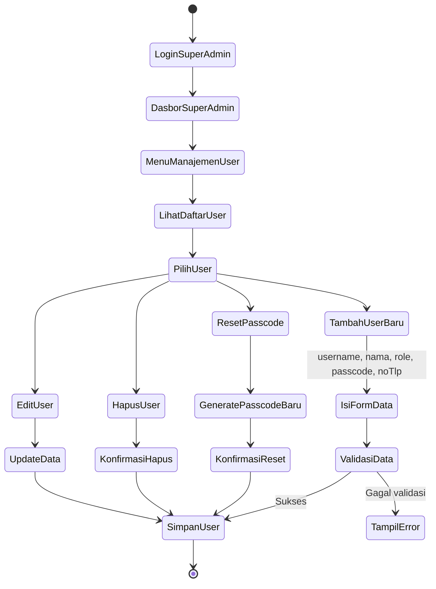

#### B. Aktivitas: Database Backup

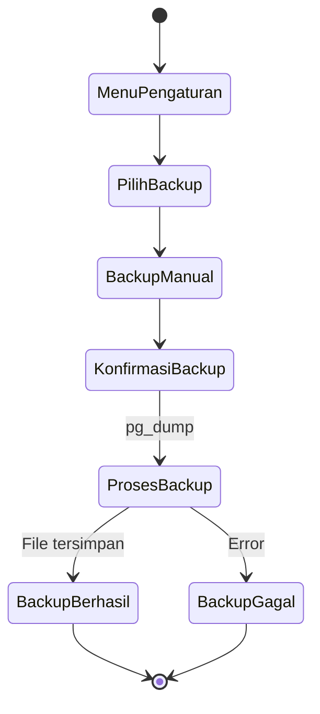

#### C. Aktivitas: Konfigurasi Sistem & Role Permission

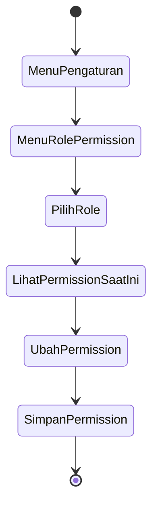

---

### 3.2 Admin

#### A. Aktivitas: Kelola Tahun Akademik

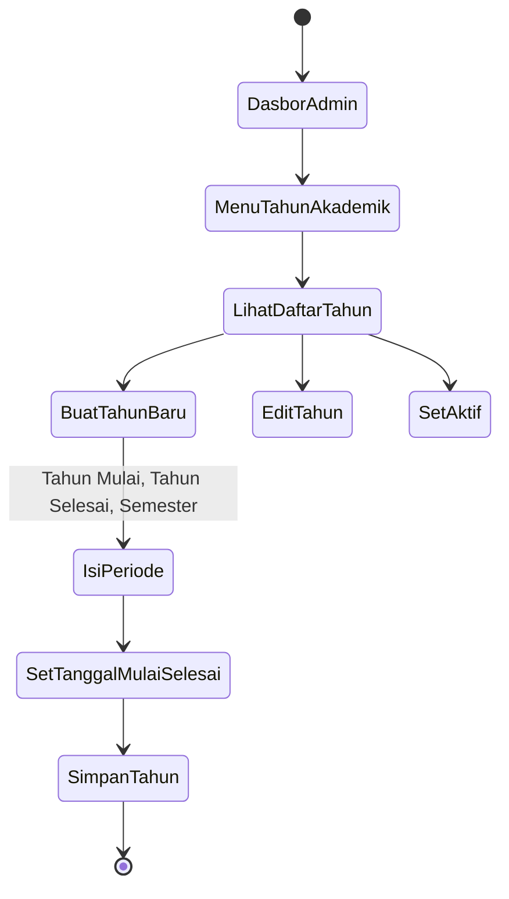

#### B. Aktivitas: Kelola Halaqah

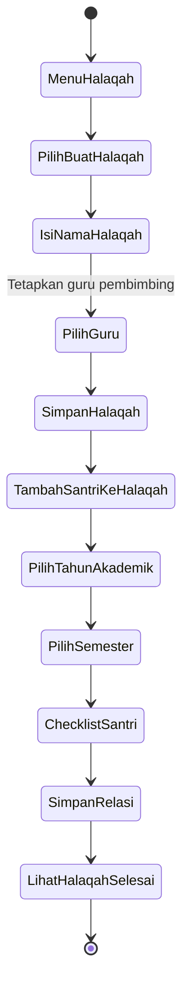

#### C. Aktivitas: Kelola Template Ujian

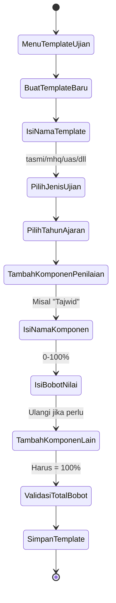

#### D. Aktivitas: Kelola Template Raport

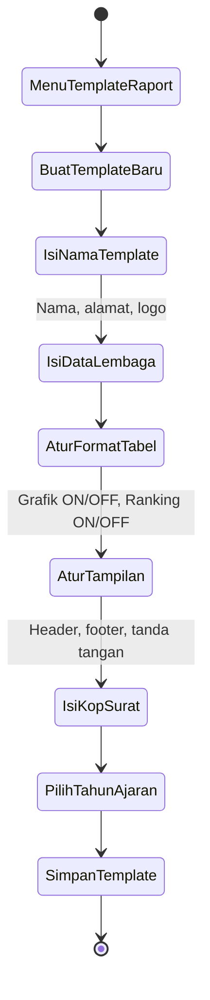

#### E. Aktivitas: Cross-Halaqah Guru Permission

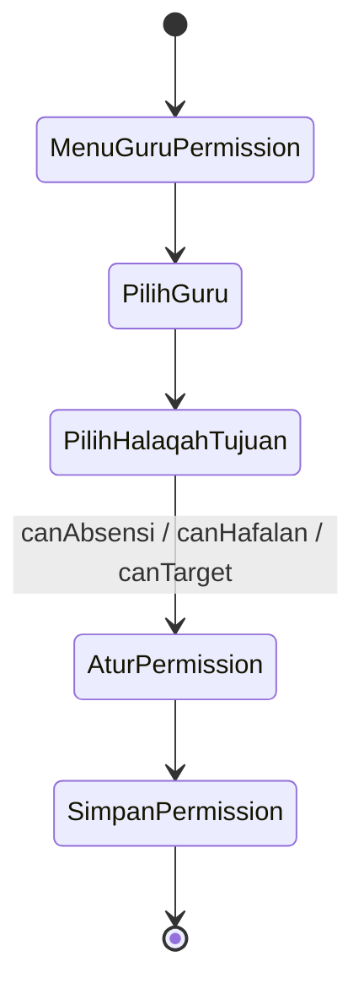

#### F. Aktivitas: Buat Pengumuman

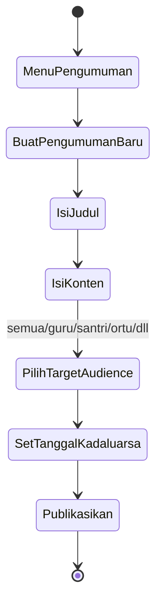

#### G. Aktivitas: Verifikasi Ujian

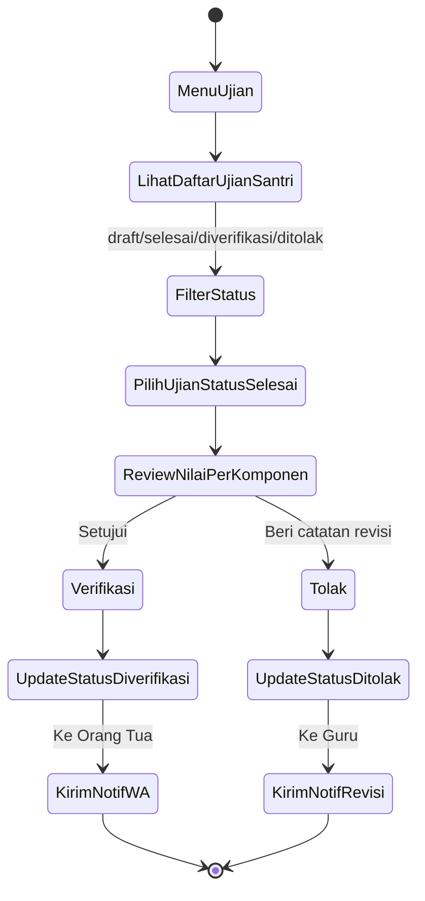

---

### 3.3 Guru

#### A. Aktivitas: Input Absensi Harian

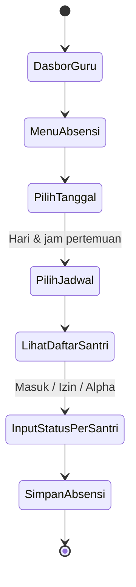

#### B. Aktivitas: Input Hafalan (Ziyadah/Murojaah)

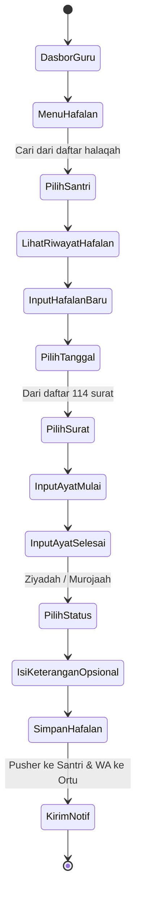

#### C. Aktivitas: Kelola Target Hafalan Santri

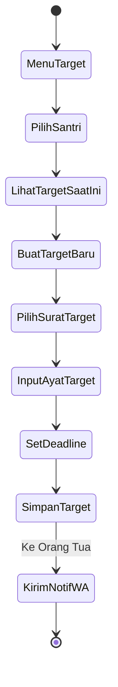

#### D. Aktivitas: Input Ujian & Penilaian

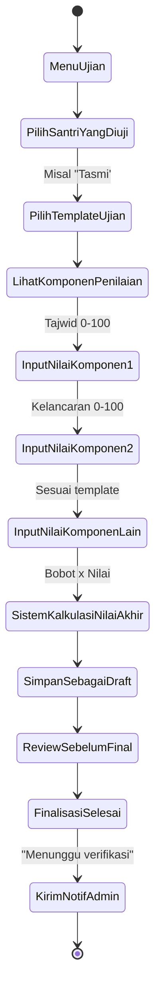

#### E. Aktivitas: Manage Prestasi Santri

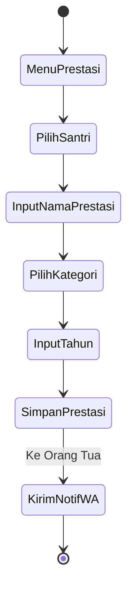

#### F. Aktivitas: Generate Raport

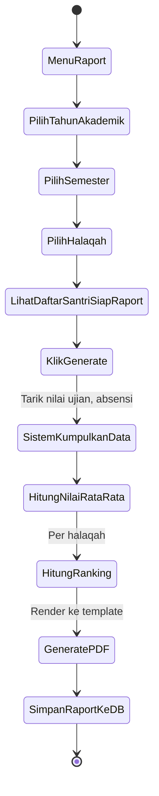

#### G. Aktivitas: Lihat Dashboard & Grafik

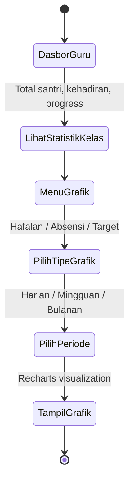

---

### 3.4 Santri

#### A. Aktivitas: Lihat Dashboard Pribadi

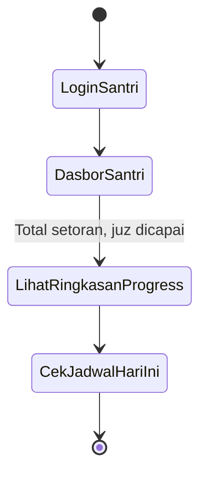

#### B. Aktivitas: Lihat Progress Juz

```mermaid
stateDiagram-v2
    [*] --> MenuProgressJuz
    MenuProgressJuz --> LihatVisualisasi30Juz: Juz 1-30
    LihatVisualisasi30Juz --> LihatDetailPerJuz: Surat & ayat yang sudah disetor
    LihatDetailPerJuz --> ProgressOtomatis: Hijau selesai, abu-abu belum
    ProgressOtomatis --> [*]
```

#### C. Aktivitas: Lihat Riwayat Hafalan

```mermaid
stateDiagram-v2
    [*] --> MenuHafalan
    MenuHafalan --> LihatRiwayatSetoran: Tabel tanggal, surat, ayat
    LihatRiwayatSetoran --> FilterBulan: Scroll riwayat
    FilterBulan --> [*]
```

#### D. Aktivitas: Cek Target Hafalan

```mermaid
stateDiagram-v2
    [*] --> MenuTarget
    MenuTarget --> LihatDaftarTarget
    LihatDaftarTarget --> LihatProgressTarget: "Juz 30: 50% tercapai"
    LihatProgressTarget --> LihatDeadline: Sisa waktu
    LihatDeadline --> [*]
```

#### E. Aktivitas: Lihat Absensi

```mermaid
stateDiagram-v2
    [*] --> MenuAbsensi
    MenuAbsensi --> LihatRekapKehadiran: Total hadir/izin/alpha
    LihatRekapKehadiran --> LihatDetailPerBulan
    LihatDetailPerBulan --> [*]
```

#### F. Aktivitas: Lihat Raport & Nilai Ujian

```mermaid
stateDiagram-v2
    [*] --> MenuRaport
    MenuRaport --> LihatDaftarRaport: Per tahun akademik
    LihatDaftarRaport --> PilihRaport
    PilihRaport --> LihatNilaiPerKomponen
    LihatNilaiPerKomponen --> DownloadPDF
    LihatNilaiPerKomponen --> [*]
    DownloadPDF --> [*]
```

---

### 3.5 Orang Tua (Ortu)

#### A. Aktivitas: Dashboard Multi-Child

```mermaid
stateDiagram-v2
    [*] --> LoginOrtu
    LoginOrtu --> DasborOrtu
    DasborOrtu --> LihatDaftarAnak
    LihatDaftarAnak --> PilihAnak: Jika memiliki lebih dari 1
    PilihAnak --> LihatRingkasanAnak: Hafalan, absensi, target
    LihatRingkasanAnak --> [*]
```

#### B. Aktivitas: Pantau Hafalan Anak

```mermaid
stateDiagram-v2
    [*] --> MenuHafalanAnak
    MenuHafalanAnak --> PilihAnak
    PilihAnak --> LihatGrafikProgressHafalan
    LihatGrafikProgressHafalan --> LihatRiwayatSetoranTerbaru
    LihatRiwayatSetoranTerbaru --> [*]
```

#### C. Aktivitas: Lihat Absensi Anak

```mermaid
stateDiagram-v2
    [*] --> MenuAbsensiAnak
    MenuAbsensiAnak --> PilihAnak
    PilihAnak --> LihatRekapHarian: Hijau hadir, merah alpha
    LihatRekapHarian --> LihatStatistikBulanIni
    LihatStatistikBulanIni --> [*]
```

#### D. Aktivitas: Lihat & Download Raport Anak

```mermaid
stateDiagram-v2
    [*] --> MenuRaportAnak
    MenuRaportAnak --> PilihAnak
    PilihAnak --> LihatDaftarRaport
    LihatDaftarRaport --> PilihRaportPerPeriode
    PilihRaportPerPeriode --> LihatDetailNilai
    LihatDetailNilai --> DownloadPDF
    LihatDetailNilai --> [*]
    DownloadPDF --> [*]
```

---

### 3.6 Yayasan

#### A. Aktivitas: Lihat Executive Dashboard

```mermaid
stateDiagram-v2
    [*] --> LoginYayasan
    LoginYayasan --> DasborEksekutif
    DasborEksekutif --> LihatTotalSantriAktif
    LihatTotalSantriAktif --> LihatPersentaseKetercapaianTarget
    LihatPersentaseKetercapaianTarget --> LihatPerformaGuru: Rata-rata nilai santri per guru
    LihatPerformaGuru --> LihatTrenHafalanBulanan
    LihatTrenHafalanBulanan --> [*]
```

#### B. Aktivitas: Lihat Laporan Komprehensif

```mermaid
stateDiagram-v2
    [*] --> MenuLaporan
    MenuLaporan --> PilihJenisLaporan: Tahfidz / Ujian / Kehadiran
    PilihJenisLaporan --> PilihPeriode: Tahun akademik & semester
    PilihPeriode --> PilihFilter: Per halaqah / per guru
    PilihFilter --> TampilLaporan: Data aggregate
    TampilLaporan --> [*]
```

#### C. Aktivitas: Lihat Data Santri

```mermaid
stateDiagram-v2
    [*] --> MenuSantri
    MenuSantri --> LihatDaftarSemuaSantri
    LihatDaftarSemuaSantri --> FilterHalaqah
    FilterHalaqah --> LihatDetailSantri: Progress, absensi, ujian
    LihatDetailSantri --> [*]
```

---

## 4. Use Case Diagram per Role

### 4.1 Super Admin Use Case

```mermaid
flowchart LR
    SuperAdmin((Super Admin))
    
    SuperAdmin --> UC1(Kelola Pengguna)
    SuperAdmin --> UC2(Kelola Role & Permission)
    SuperAdmin --> UC3(Backup Database)
    SuperAdmin --> UC4(Kelola Pengaturan Sistem)
    SuperAdmin --> UC5(Lihat Dashboard Global)
    SuperAdmin --> UC6(Reset Passcode Pengguna)
    SuperAdmin --> UC7(Lihat Audit Log)
    
    UC1 --> UC1a(Tambah Pengguna)
    UC1 --> UC1b(Edit Pengguna)
    UC1 --> UC1c(Hapus Pengguna)
    UC1 --> UC1d(Lihat Daftar Pengguna)
    
    UC2 --> UC2a(Ubah Permission Role)
    UC2 --> UC2b(Lihat Permission Role)
    
    UC3 --> UC3a(Backup Manual)
    UC3 --> UC3b(Jadwalkan Backup Otomatis)
    UC3 --> UC3c(Lihat Riwayat Backup)
```

### 4.2 Admin Use Case

```mermaid
flowchart LR
    Admin((Admin Akademik))
    
    Admin --> UC1(Kelola Halaqah)
    Admin --> UC2(Kelola Tahun Akademik)
    Admin --> UC3(Kelola Template Ujian)
    Admin --> UC4(Kelola Template Raport)
    Admin --> UC5(Kelola Jadwal Halaqah)
    Admin --> UC6(Kelola Pengumuman)
    Admin --> UC7(Kelola Guru Permission)
    Admin --> UC8(Verifikasi Ujian)
    Admin --> UC9(Lihat Laporan Global)
    Admin --> UC10(Kelola Jenis Ujian)
    Admin --> UC11(Lihat Dashboard Admin)
    
    UC1 --> UC1a(Buat Halaqah)
    UC1 --> UC1b(Assign Guru ke Halaqah)
    UC1 --> UC1c(Assign Santri ke Halaqah)
    UC1 --> UC1d(Lihat Daftar Halaqah)
    UC1 --> UC1e(Hapus Halaqah)
    
    UC2 --> UC2a(Buat Tahun Akademik)
    UC2 --> UC2b(Set Tahun Aktif)
    UC2 --> UC2c(Generate Otomatis)
    
    UC3 --> UC3a(Buat Template)
    UC3 --> UC3b(Tambah Komponen Penilaian)
    UC3 --> UC3c(Set Bobot Nilai)
    
    UC6 --> UC6a(Tentukan Target Audience)
    UC6 --> UC6b(Set Tanggal Kadaluarsa)
    UC6 --> UC6c(Lihat Status Baca)
    
    UC7 --> UC7a(Beri Akses Halaqah Lain)
    UC7 --> UC7b(Cabut Akses)
    
    UC8 --> UC8a(Setujui Ujian)
    UC8 --> UC8b(Tolak Ujian dengan Catatan)
```

### 4.3 Guru Use Case

```mermaid
flowchart LR
    Guru((Guru Halaqah))
    
    Guru --> UC1(Input Absensi Santri)
    Guru --> UC2(Input Hafalan Santri)
    Guru --> UC3(Kelola Target Hafalan)
    Guru --> UC4(Input Nilai Ujian)
    Guru --> UC5(Kelola Prestasi Santri)
    Guru --> UC6(Generate Raport)
    Guru --> UC7(Lihat Dashboard Guru)
    Guru --> UC8(Lihat Grafik & Statistik)
    Guru --> UC9(Lihat Pengumuman)
    Guru --> UC10(Kelola Profil)
    
    UC1 --> UC1a(Input Massal per Halaqah)
    UC1 --> UC1b(Edit Status Absensi)
    
    UC2 --> UC2a(Input Ziyadah)
    UC2 --> UC2b(Input Murojaah)
    UC2 --> UC2c(Lihat Riwayat Hafalan Santri)
    
    UC3 --> UC3a(Buat Target Baru)
    UC3 --> UC3b(Lihat Progress Target)
    UC3 --> UC3c(Hapus Target)
    
    UC4 --> UC4a(Pilih Template Ujian)
    UC4 --> UC4b(Input Per Komponen)
    UC4 --> UC4c(Finalisasi Draft)
    
    UC5 --> UC5a(Catat Prestasi Baru)
    UC5 --> UC5b(Lihat Daftar Prestasi)
    
    UC6 --> UC6a(Generate PDF)
    UC6 --> UC6b(Download Raport)
```

### 4.4 Santri Use Case

```mermaid
flowchart LR
    Santri((Santri))
    
    Santri --> UC1(Lihat Dashboard Pribadi)
    Santri --> UC2(Lihat Progress Juz)
    Santri --> UC3(Lihat Riwayat Hafalan)
    Santri --> UC4(Lihat Target Hafalan)
    Santri --> UC5(Lihat Absensi Pribadi)
    Santri --> UC6(Lihat Jadwal Halaqah)
    Santri --> UC7(Lihat Nilai Ujian)
    Santri --> UC8(Lihat Raport)
    Santri --> UC9(Lihat Pengumuman)
    Santri --> UC10(Terima Notifikasi)
    Santri --> UC11(Kelola Profil)
    
    UC2 --> UC2a(Visual 30 Juz)
    UC2 --> UC2b(Detail Per Juz)
    
    UC5 --> UC5a(Rekap Kehadiran)
    UC5 --> UC5b(Detail Per Bulan)
    
    UC8 --> UC8a(Lihat Nilai)
    UC8 --> UC8b(Download PDF)
```

### 4.5 Orang Tua Use Case

```mermaid
flowchart LR
    Ortu((Orang Tua))
    
    Ortu --> UC1(Lihat Dashboard Multi-Child)
    Ortu --> UC2(Pantau Hafalan Anak)
    Ortu --> UC3(Pantau Absensi Anak)
    Ortu --> UC4(Pantau Target Hafalan)
    Ortu --> UC5(Lihat Raport Anak)
    Ortu --> UC6(Lihat Pengumuman)
    Ortu --> UC7(Terima Notifikasi WhatsApp)
    Ortu --> UC8(Kelola Profil)
    
    UC1 --> UC1a(Pilih Anak)
    UC1 --> UC1b(Lihat Ringkasan Semua Anak)
    
    UC2 --> UC2a(Grafik Progress)
    UC2 --> UC2b(Riwayat Setoran)
    
    UC5 --> UC5a(Lihat Nilai)
    UC5 --> UC5b(Download PDF)
```

### 4.6 Yayasan Use Case

```mermaid
flowchart LR
    Yayasan((Yayasan))
    
    Yayasan --> UC1(Lihat Executive Dashboard)
    Yayasan --> UC2(Lihat Laporan Tahfidz)
    Yayasan --> UC3(Lihat Laporan Ujian)
    Yayasan --> UC4(Lihat Laporan Kehadiran)
    Yayasan --> UC5(Lihat Data Santri)
    Yayasan --> UC6(Lihat Performa Guru)
    Yayasan --> UC7(Lihat Pengumuman)
    Yayasan --> UC8(Terima Notifikasi)
    Yayasan --> UC9(Kelola Profil)
    
    UC1 --> UC1a(Total Santri Aktif)
    UC1 --> UC1b(Persentase Target)
    UC1 --> UC1c(Tren Hafalan Bulanan)
    
    UC2 --> UC2a(Per Halaqah)
    UC2 --> UC2b(Per Periode)
    
    UC5 --> UC5a(Daftar Semua Santri)
    UC5 --> UC5b(Detail Progress Santri)
```

---

## 5. Ringkasan Aturan Bisnis (Business Rules)

### Aturan Umum
1. Semua akses data berdasarkan role pengguna (RBAC)
2. Semua input divalidasi dengan Zod sebelum diproses
3. Semua aktivitas penting dicatat di AuditLog
4. Data transaksional terikat pada tahun akademik aktif
5. HTTP-only JWT cookie untuk autentikasi (24 jam)

### Aturan Akademik
6. Satu Santri satu Halaqah per semester
7. Satu Halaqah minimal 5 Santri, maksimal tidak dibatasi
8. Satu Guru bisa mengajar banyak Halaqah
9. Hanya satu tahun akademik aktif dalam satu waktu
10. Tahun akademik S1: Jul-Des, S2: Jan-Jun

### Aturan Hafalan
11. Ziyadah = hafalan baru, Murojaah = mengulang
12. ayatMulai harus <= ayatSelesai
13. Surat harus valid (1-114)
14. Progress juz dihitung otomatis dari akumulasi ayat

### Aturan Penilaian
15. Total bobot komponen penilaian harus 100%
16. Status ujian: draft -> selesai -> diverifikasi/ditolak
17. Ujian diverifikasi tidak bisa diubah
18. Raport unik per santri per tahun akademik

### Aturan Notifikasi
19. WhatsApp notification dikirim untuk event penting
20. Pengumuman bisa ditarget per role
21. Pengumuman dengan target santri/semua otomatis ke ortu
22. Notifikasi push real-time via Pusher

### Aturan Keamanan
23. Rate limit 5 req/min untuk login
24. Lockout setelah 10 gagal login
25. Passcode 6-10 karakter alfanumerik
26. Session JWT berlaku 24 jam

---

*Dokumentasi ini mencakup seluruh aspek sistem AR-Hafalan mulai dari bisnis proses, ERD, activity diagram, hingga use case diagram untuk setiap role pengguna.*


