# Diagram Sistem AR-Hafalan (Sistem Informasi Manajemen Hafalan Al-Quran)

Dokumen ini berisi **Class Diagram** dan **Activity Diagram** untuk seluruh fitur pada sistem
(Sistem Manajemen Hafalan Al-Quran: Next.js 15 App Router, Prisma/PostgreSQL, role-based).
Semua diagram menggunakan **Mermaid** dan dapat dirender pada GitHub, mermaid.live, atau VS Code (Mermaid plugin).

Daftar isi:
- [1. Class Diagram](#1-class-diagram)
  - [1.1 Master, Role & Organisasi](#11-master-role--organisasi)
  - [1.2 Akademik](#12-akademik)
  - [1.3 Ujian](#13-ujian)
  - [1.4 Raport & Kelulusan](#14-raport--kelulusan)
  - [1.5 Sistem (Notifikasi, Pengumuman, Audit)](#15-sistem-notifikasi-pengumuman-audit)
- [2. Activity Diagram](#2-activity-diagram)
  - [2.1 Autentikasi & Keamanan](#21-autentikasi--keamanan)
  - [2.2 Super Admin](#22-super-admin)
  - [2.3 Admin](#23-admin)
  - [2.4 Guru](#24-guru)
  - [2.5 Santri](#25-santri)
  - [2.6 Orang Tua](#26-orang-tua)
  - [2.7 Yayasan](#27-yayasan)
  - [2.8 Layanan Otomatis (Cron & WhatsApp)](#28-layanan-otomatis-cron--whatsapp)
- [3. Sequence Diagram](#3-sequence-diagram)
  - [3.1 Login & RBAC](#31-login--rbac)
  - [3.2 Lupa Passcode](#32-lupa-passcode)
  - [3.3 Kelola Pengguna (Super Admin)](#33-kelola-pengguna-super-admin)
  - [3.4 Template Ujian & Komponen (Admin)](#34-template-ujian--komponen-admin)
  - [3.5 Input Absensi (Guru)](#35-input-absensi-guru)
  - [3.6 Setoran Hafalan (Guru)](#36-setoran-hafalan-guru)
  - [3.7 Target Hafalan (Guru)](#37-target-hafalan-guru)
  - [3.8 Ujian & Remedial (Guru ↔ Admin)](#38-ujian--remedial-guru--admin)
  - [3.9 Generate & Cetak Raport](#39-generate--cetak-raport)
  - [3.10 Pengumuman Broadcast](#310-pengumuman-broadcast)
  - [3.11 Monitoring Multi-Anak (Ortu)](#311-monitoring-multi-anak-ortu)
  - [3.12 Cron Rekap Absensi WA](#312-cron-rekap-absensi-wa)
- [4. Lampiran: Pemetaan Fitur ke Kode](#4-lampiran-pemetaan-fitur-ke-kode)

---

# 1. Class Diagram

Class diagram berikut memetakan 24 model pada `prisma/schema.prisma` ke dalam konsep kelas
diagram UML (atribut + hubungan). Nama field mengikuti skema Prisma.

## 1.1 Master, Role & Organisasi

Mencakup: `User`, `Role`, `Guru`, `Santri`, `OrangTua`, `TahunAjaran`, `Semester`, `Halaqah`.
`HalaqahSantri` (pivot), `GuruPermission`, `JenisUjian`, `Surah`.

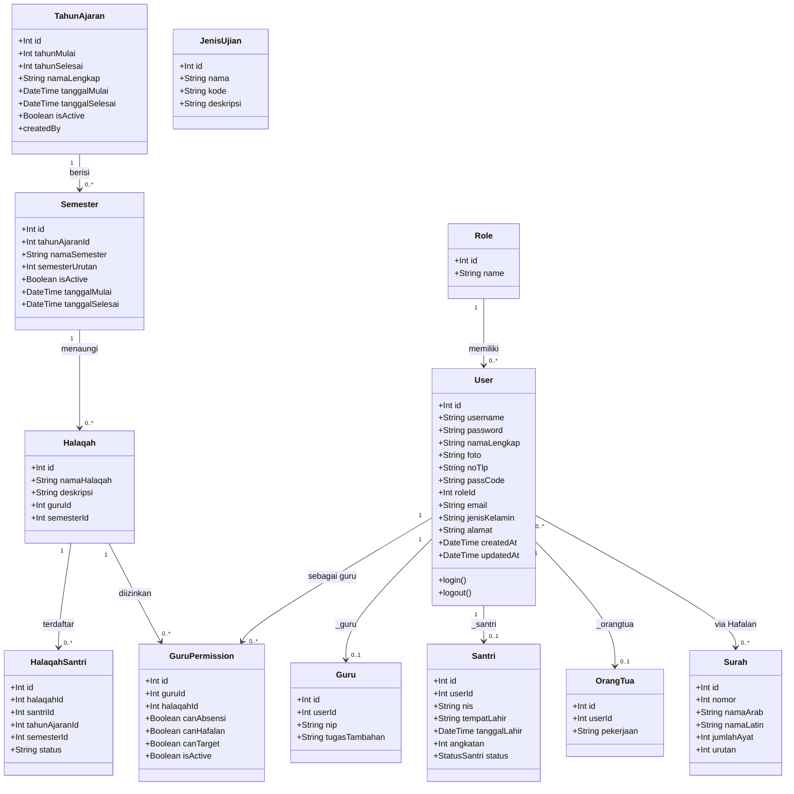

## 1.2 Akademik

Mencakup: `Jadwal`, `Absensi`, `Hafalan`, `TargetHafalan`, `Prestasi`, `Surah`.

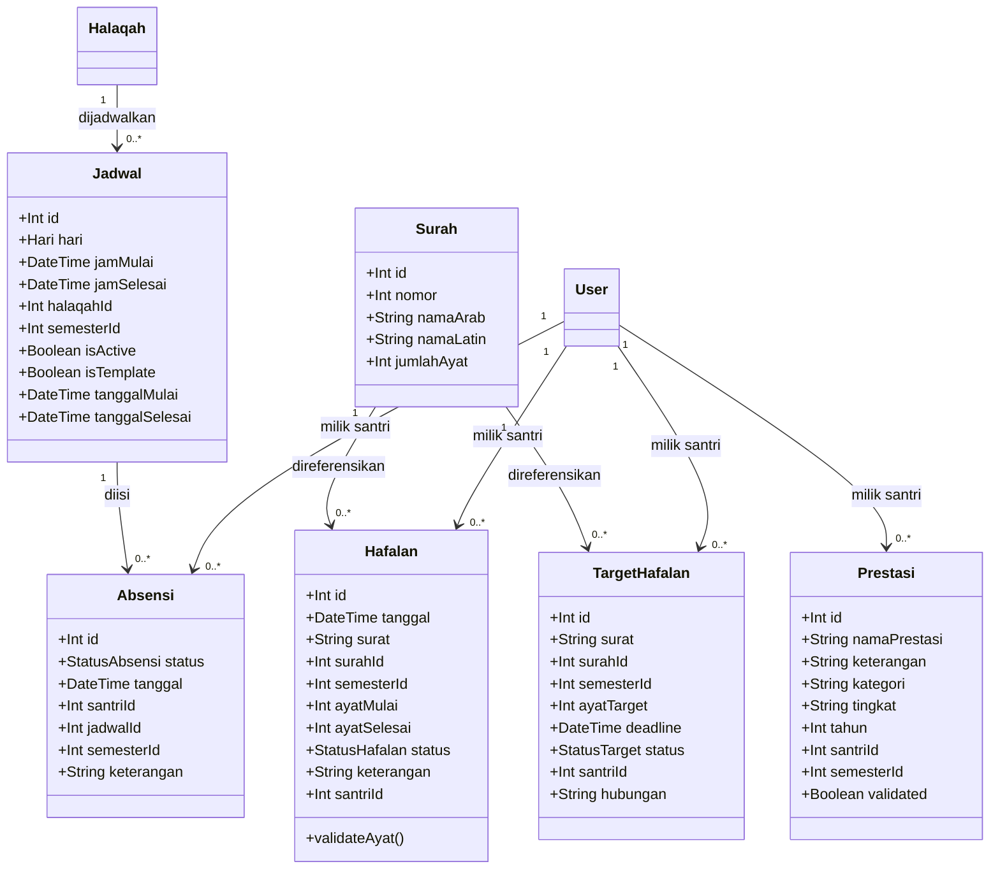

## 1.3 Ujian

Mencakup: `TemplateUjian`, `JenisUjian`, `KomponenPenilaian`, `UjianSantri` beserta enum dan
evaluasi per-juz.

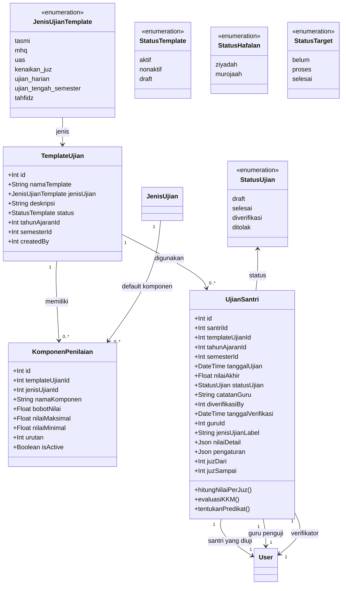

> **Keterangan hasil per-juz:** `nilaiPerJuz`, `juzRemedialList`, dan `predikatAkhir` dihitung
> oleh fungsi `calculateNilaiPerJuz` (lihat DTO `PerJuzEvaluation` pada 1.4).

> **Nilai per-juz** (lihat `lib/utils/hafalanAssessment.ts`):
> - `nilaiDetail` disimpan sebagai JSON berisi nilai tiap komponen per juz
>   (contoh key `juz-30-p1-kelancaran`).
> - `pengaturan` berisi `nilaiPerJuz`, `juzRemedialList`, `kkm`, `statusKelulusan`,
>   `rekomendasiRemedial`, `predikatAkhir`.

## 1.4 Raport & Kelulusan

Mencakup: `TemplateUjianRaport`, `RaportSantri` berikut struktur hasil evaluasi KKM per-juz.

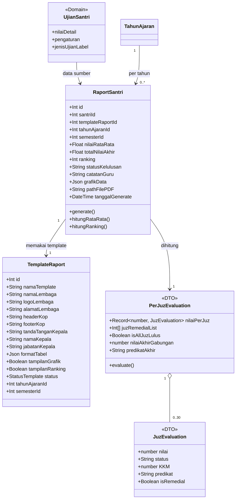

## 1.5 Sistem (Notifikasi, Pengumuman, Audit)

Mencakup: `Pengumuman`, `PengumumanRead`, `Notifikasi`, `NotifikasiPenerima`,
`TargetNotifikasi`, `OrangTuaSantri`, `AuditLog`, `ForgotPasscode`, `SystemSetting`.

```mermaid
classDiagram
    class Pengumuman {
        +Int id
        +String judul
        +String isi
        +DateTime tanggal
        +DateTime tanggalKadaluarsa
        +TargetAudience targetAudience
        +Int createdBy
    }

    class PengumumanRead {
        +Int id
        +Int pengumumanId
        +Int userId
        +DateTime dibacaPada
    }

    class Notifikasi {
        +Int id
        +String judul
        +String isi
        +String pesan
        +String kategori
        +String channel
        +String prioritas
        +NotifType type
        +Int refId
        +Boolean isRead
        +DateTime readAt
        +Int userId
        +Int createdBy
    }

    class NotifikasiPenerima {
        +Int id
        +Int notifikasiId
        +Int userId
        +Boolean isRead
        +DateTime readAt
    }

    class TargetNotifikasi {
        +Int id
        +Int notifikasiId
        +String role
        +Int angkatan
        +Int halaqahId
    }

    class OrangTuaSantri {
        +Int id
        +Int orangTuaId
        +Int santriId
        +String hubungan
    }

    class AuditLog {
        +Int id
        +String action
        +String keterangan
        +DateTime tanggal
        +Int userId
        +String ipAddress
        +String userAgent
        +String module
    }

    class ForgotPasscode {
        +Int id
        +String phoneNumber
        +String message
        +Boolean isRead
        +Boolean isRegistered
        +Int userId
    }

    class SystemSetting {
        +String id
        +Json data
    }

    class NotifType {
        <<enumeration>>
        user
        hafalan
        rapot
        absensi
        pengumuman
    }

    class TargetAudience {
        <<enumeration>>
        semua
        guru
        santri
        admin
        ortu
        yayasan
        super_admin
    }

    Pengumuman "1" --> "0..*" PengumumanRead : dibaca
    User "1" --> "0..*" PengumumanRead
    Notifikasi "1" --> "0..*" NotifikasiPenerima : diteruskan
    Notifikasi "1" --> "0..*" TargetNotifikasi : sasaran
    Role "--" TargetNotifikasi : peran
    Halaqah "--" TargetNotifikasi : halaqah
    User "1" --> "0..*" OrangTuaSantri : sebagai ortu
    User "1" --> "0..*" OrangTuaSantri : sebagai anak
    User "1" --> "0..*" AuditLog : mencatat
    User "0..1" --> "0..*" ForgotPasscode : meminta reset
    SystemSetting : menyimpan KKM default & konfig WA
```

---

# 2. Activity Diagram

Alur aktivitas memakai notasi `flowchart` Mermaid.
Aktor: **Pengunjung**, **Siswa**, **Guru**, **Admin**, **Super Admin**, **Orang Tua**, **Yayasan**, **Sistem (cron)**.

## 2.1 Autentikasi & Keamanan

### 2.1.1 Login Passcode / Username

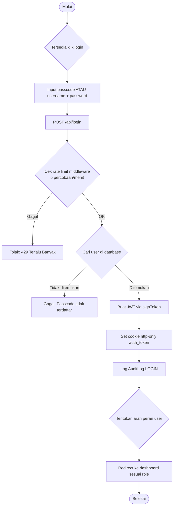

### 2.1.2 Verify Token & RBAC (middleware)

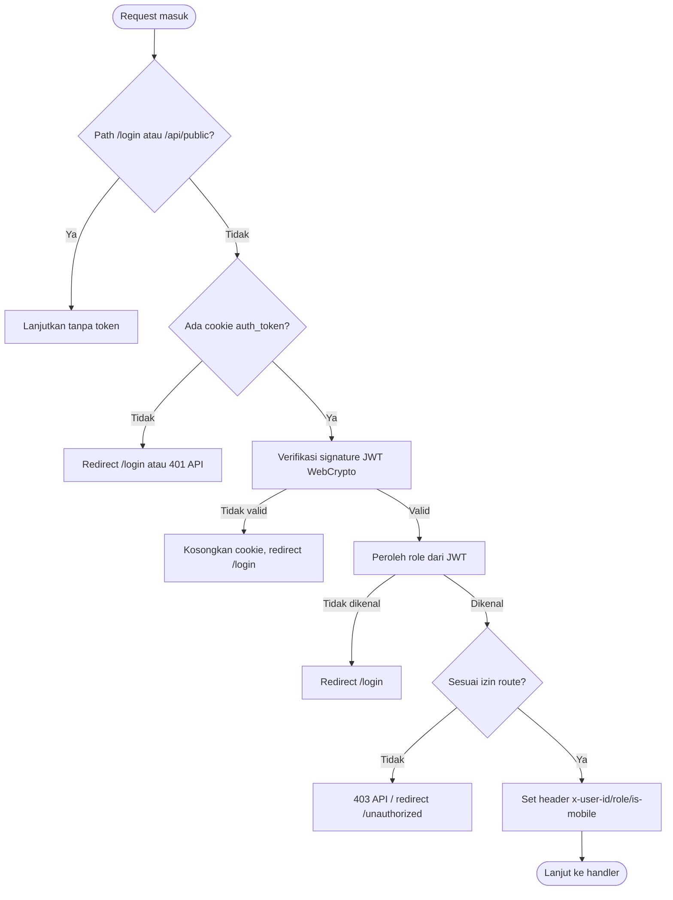

### 2.1.3 Lupa Passcode (alur OOP: publik + super admin)

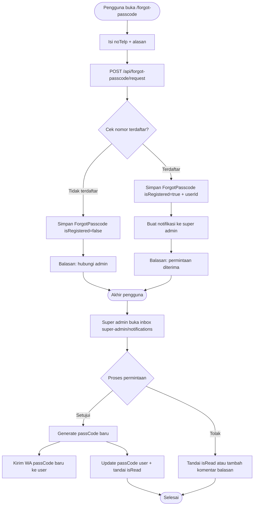

## 2.2 Super Admin

### 2.2.1 Kelola Pengguna

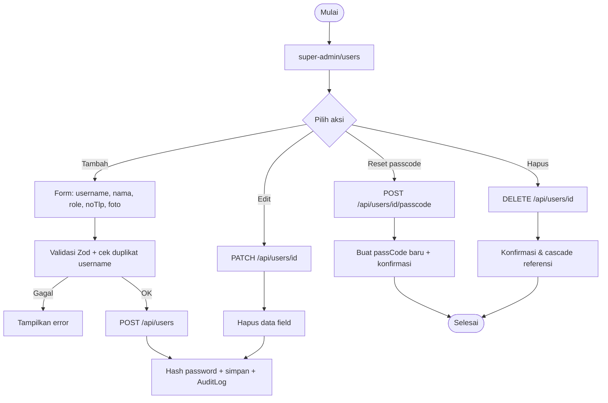

### 2.2.2 Backup & Manajemen Database

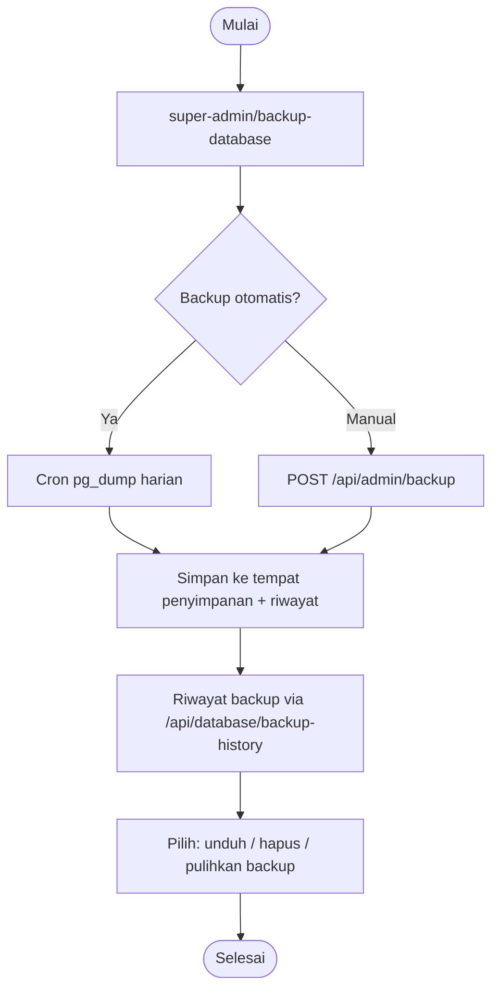

### 2.2.3 Dashboard & Notifikasi Global

```mermaid
flowchart TD
    A([Mulai]) --> B[Buka /super-admin/dashboard]
    B --> C[GET /api/analytics/global-reports + dashboard]
    C --> D[Tampilkan metrik sistem global]
    B --> E[Buka /super-admin/notifications]
    E --> F[Lihat notifikasi + inbox forgot-passcode]
    F --> G[Proses reset passcode (lihat 2.1.3)]
    D --> H([Selesai])
```

---

## 2.3 Admin

### 2.3.1 Kelola Tahun Akademik & Semester

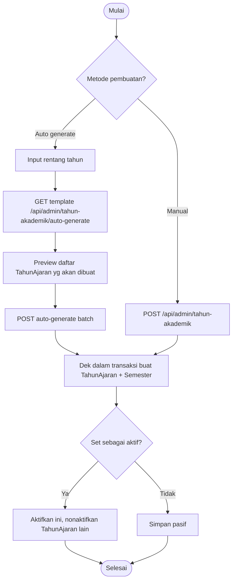

### 2.3.2 Halaqah & Siapkan Santri

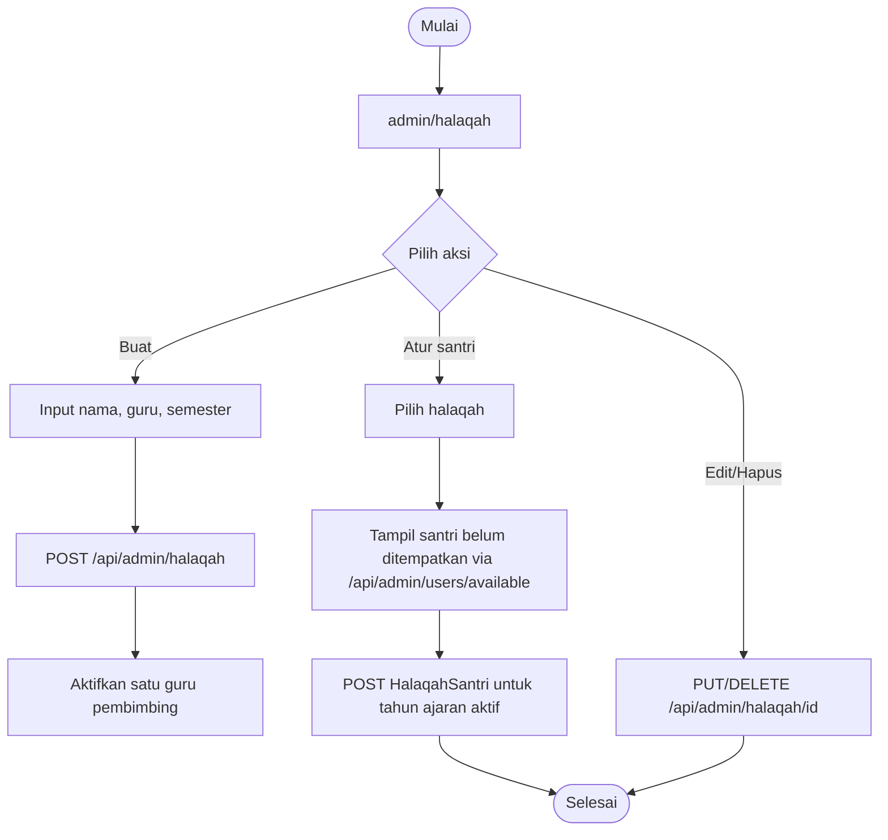

### 2.3.3 Guru Permission (cross-halaqah)

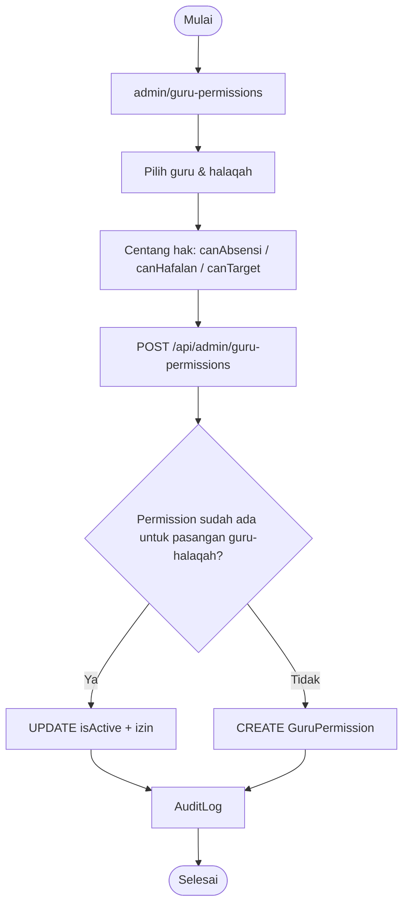

### 2.3.4 Template Ujian & Komponen

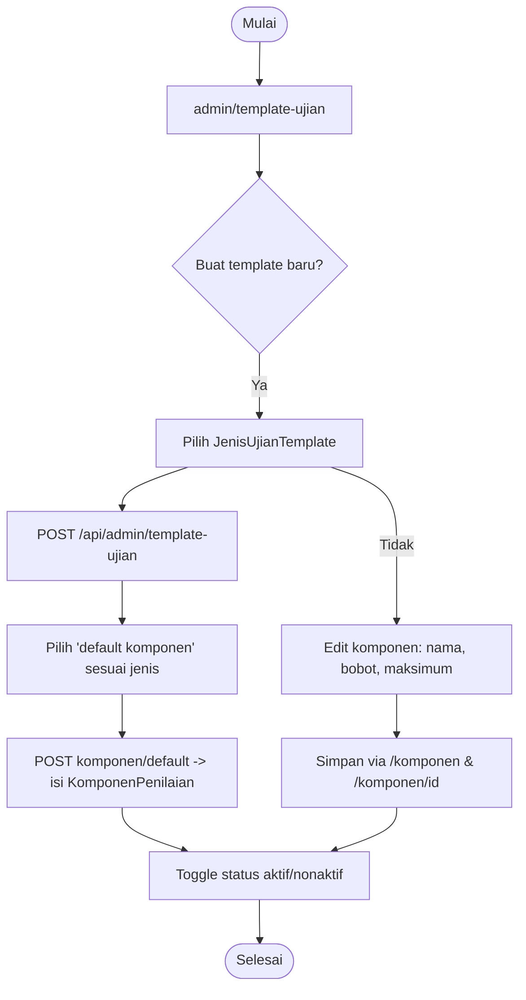

### 2.3.5 Jadwal Halaqah

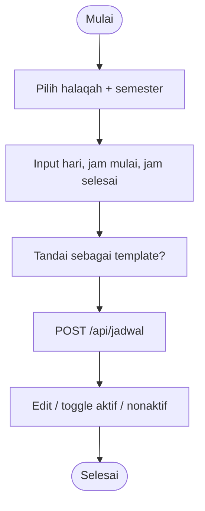

### 2.3.6 Verifikasi Ujian (status juz bermasalah)

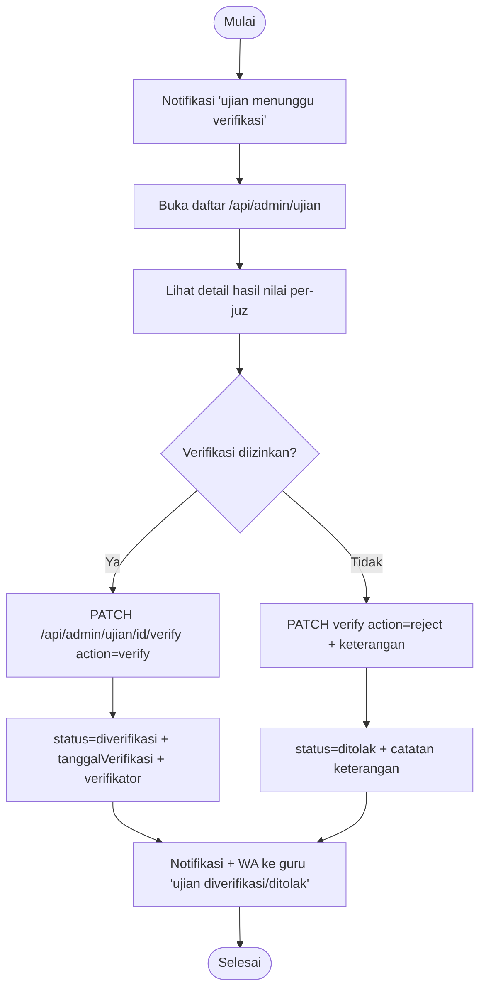

### 2.3.7 Generate & Cetak Raport

```mermaid
flowchart TD
    A([Mulai]) --> B[Pilih santri / template / tahun ajaran]
    B --> C[POST /api/admin/generate-raport]
    C --> D[Ambil semua UjianSantri thn tsb status selesai/diverifikasi]
    D --> E[Ambil nilai per-juz dari pengaturan.nilaiPerJuz]
    E --> F[Hitung nilai rata-rata + predikat]
    E --> G[Hitung ranking vs seluruh santri se-tahun]
    F --> H{Hasil >= KKM (default 70)?}
    H -- Ya --> I[statusKelulusan Lulus + predikat]
    H -- Tidak + ada override --> J[Tidak Lulus + predikat]
    H -- Tidak + tanpa override --> K[Perbaikan/Remedial Required]
    I --> L[Simpan / update RaportSantri + grafikData + rekapPerJuz]
    J --> L
    K --> L
    L --> M[Download/print PDF / batch]
    M --> N([Selesai])
```

### 2.3.8 Pengumuman & WA Broadcast

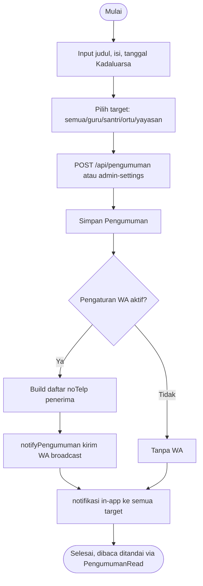

---

## 2.4 Guru

### 2.4.1 Input Absensi

```mermaid
flowchart TD
    A([Mulai]) --> B[Buka /guru/absensi]
    B --> C[Pilih tanggal + jadwal/halaqah]
    C --> D[GET /api/guru/absensi -> daftar santri]
    D --> E{Tanggal masa depan?}
    E -- Ya --> E2[Tolak "tidak dapat mengisi masa depan"]
    E2 --> M
    E -- Tidak --> F{Berada pada rentang waktu jadwal?}
    F -- Tidak --> F2[Tolak di luar rentang waktu]
    F2 --> M
    F -- Ya --> G[Pilih status tiap santri: masuk/izin/alpha]
    G --> H[POST /api/guru/absensi]
    H --> I{Cek apakah absensi sudah ada?}
    I -- Ya --> J[UPDATE]
    I -- Tidak --> K[CREATE]
    J --> L[Auditlog CREATE/UPDATE_ABSENSI]
    K --> L
    L --> M([Selesai, rekap WA malam via cron])
```

### 2.4.2 Input Setoran Hafalan (Ziyadah / Muroja'ah)

```mermaid
flowchart TD
    A([Mulai]) --> B[Pilih santri + mushaf digital]
    B --> C[Input surat, ayat mulai, ayat selesai]
    C --> D[Pilih status ziyadah / murojaah]
    D --> E{Validasi rentang ayat?}
    E -- Tidak valid --> E2(Tampilkan error validasi)
    E2 --> C
    E -- Valid --> F[POST /api/guru/hafalan]
    F --> G[Simpan Hafalan baru]
    G --> H[Notifikasi WA ke orang tua]
    H --> I([Selesai])
```

### 2.4.3 Manajemen Target Hafalan Santri

```mermaid
flowchart TD
    A([Mulai]) --> B[Pilih santri]
    B --> C[Input surat, ayatTarget, deadline]
    C --> D{Target surat ini sudah ada & belum selesai?}
    D -- Ya --> E[Tolak "target sudah ada"]
    E --> C
    D -- Tidak --> F[POST /api/guru/target]
    F --> G[Simpan TargetHafalan status=belum]
    G --> H[Notifikasi in-app ke santri]
    H --> I[Perbarui status: belum/proses/selesai oleh guru]
    I --> J{Status selesai?}
    J -- Ya --> K[notifyTarget WA ke orang tua]
    J -- Tidak --> L[Lewati WA]
    K --> M([Selesai])
    L --> M
```

### 2.4.4 Wizard Penilaian Ujian (multi-juz + mushaf)

```mermaid
flowchart TD
    A([Mulai]) --> B[Pilih jenis ujian: kenaikan_juz/mhq/tasmi/dll]
    B --> C[Set rentang juz dari-sampai (1..30)]
    C --> D[Pilih santri yang dinilai]
    D --> E{Bentuk UI}
    E -- Desktop --> F[[Split-screen: panel form 5 kolom + mushaf 7 kolom]]
    E -- Mobile --> G[[Persistent bottom-sheet 3 status + mushaf di latar]]
    F --> H[Input nilai per komponen per juz]
    G --> H
    H --> I[Server: calculateNilaiPerJuz]
    I --> J[Hasil: nilaiPerJuz + daftar juz di bawah KKM]
    J --> K{Ada juz di bawah KKM?}
    K -- Tidak --> L[status LULUS semua juz]
    K -- Ya --> M{Ada keinginan remedial?}
    M -- Ya --> N[Jadwalkan remedial per-juz (lihat 2.4.5)]
    M -- Tidak & override --> O[overrideRemedial=true + alasan]
    N --> P[Simpan UjianSantri + parameter di pengaturan]
    O --> P
    L --> P
    P --> Q[POST /api/guru/ujian lalu PATCH /id/submit]
    Q --> R{Sistem rekomendasi remedial tanpa override?}
    R -- Ya --> S[422: paksa keputusan remedial]
    S --> T[Pilih remedial atau konfirmasi tanpa remedial]
    R -- Tidak --> U[statusUjian=selesai]
    U --> V[Notifikasi & WA ke admin menunggu verifikasi]
    T --> W([Verifikasi oleh admin 2.3.6])
    V --> W
```

### 2.4.5 Remedial per Juz

```mermaid
flowchart TD
    A([Mulai]) --> B[Terdeteksi daftar juz di bawah KKM]
    B --> C[Guru pilih ujian dasar]
    C --> D[POST /api/guru/ujian/ID/remedial targetJuz]
    D --> E[Buat UjianSantri baru draft]
    E --> F[Set pengaturan.isRemedial=true + parentUjianId]
    F --> G[Nilai ulang juz bermasalah saja]
    G --> H[Submit ulang -> STATUSU selesai]
    H --> I([Menunggu verifikasi, join nilai utk performa])
```

### 2.4.6 Pencatatan Prestasi

```mermaid
flowchart TD
    A([Mulai]) --> B[Pilih santri + nama prestasi + tahun]
    B --> C[POST /api/guru/prestasi]
    C --> D[Simpan Prestasi validated=false]
    D --> E[notifikasi WA ke ortu]
    E --> F[Guru dapat edit / hapus]
    F --> G([Selesai, validasi opsional oleh admin])
```

### 2.4.7 Grafik, Laporan & Dashboard Guru

```mermaid
flowchart TD
    A([Mulai]) --> B{Pilih fungsi}
    B --> C[Grafik hafalan /api/guru/grafik/hafalan]
    B --> D[Top santri /api/guru/grafik/top-santri]
    B --> E[Laporan ujian /guru/laporan]
    C --> F[Render grafik jml ayat / tren setor]
    D --> F
    E --> G[Rangkuman nilai ujian santri]
    F --> H([Selesai])
    G --> H
```

---

## 2.5 Santri

### 2.5.1 Dashboard Santri

```mermaid
flowchart TD
    A([Mulai]) --> B[Buka /santri/dashboard]
    B --> C[GET /api/dashboard/santri]
    C --> D[Statistik hafalan tersimpan + target aktif]
    D --> E[Info jadwal & absensi terbaru]
    E --> F([Selesai])
```

### 2.5.2 Melihat Progress, Target & Rekap Hafalan

```mermaid
flowchart TD
    A([Mulai]) --> B[Pilih halaman target / rekap / progress-juz]
    B --> C{Pilih menu}
    C -- Target --> D[GET /api/santri/target]
    D --> E[Tampil daftar target + deadline]
    C -- Rekap --> F[GET /api/santri/hafalan/rekap]
    F --> G[Statistik setoran / muroja'ah]
    C -- Progress Juz --> H[GET /api/konversi/progress-juz]
    H --> I[Progres per-juz + status ujian]
    E --> J([Selesai])
    G --> J
    I --> J
```

### 2.5.3 Absensi, Jadwal & Raport Santri

```mermaid
flowchart TD
    A([Mulai]) --> B{Pilih menu}
    B -- Absensi --> C[GET /api/santri/absensi]
    C --> C2[Rekap status masuk/izin/alpha]
    B -- Jadwal --> D[GET /api/santri/jadwal]
    D --> D2[Tampil hari, jam, halaqah]
    B -- Raport --> E[GET /api/raport + detail per-juz]
    E --> E2[Download /api/admin/raport/id/print]
    C2 --> F([Selesai])
    D2 --> F
    E2 --> F
```

---

## 2.6 Orang Tua

### 2.6.1 Monitoring Multi-Anak

```mermaid
flowchart TD
    A([Mulai]) --> B[Ortu login]
    B --> C[GET /api/ortu/anak - daftar anak biasa multi-child]
    C --> D[Pilih anak]
    D --> E[GET hafalan-progress /api/ortu/hafalan-progress]
    D --> F[GET target /api/ortu/target]
    D --> G[GET absensi /api/ortu/absensi-summary]
    D --> H[GET raport anak]
    E --> J[Grafik perkembangan hafalan harian]
    F --> K[Tampil target + deadline]
    G --> L[Rekap hadir / izin / alpha]
    H --> M[Lihat raport anak + pdf]
    J --> N([Selesai])
    K --> N
    L --> N
    M --> N
```

### 2.6.2 Notifikasi & Pengumuman Ortu

```mermaid
flowchart TD
    A([Mulai]) --> B[Buka halaman pengumuman / notifikasi]
    B --> C[GET /api/ortu/pengumuman + notifikasi target]
    C --> D[Tandai dibaca]
    D --> E([Selesai])
```

---

## 2.7 Yayasan

### 2.7.1 Dashboard Eksekutif & Laporan Read-Only

```mermaid
flowchart TD
    A([Mulai]) --> B[Yayasan login]
    B --> C[GET /api/analytics/global + guru-dashboard]
    C --> D[Metrik: santri aktif, capaian target ujian, performa guru]
    B --> E{Pilih laporan}
    E --> F[Laporan halaqah]
    F --> G[Rekap kinerja per-halaqah]
    E --> H[Tren hafalan global]
    E --> I[Rangkuman ujian /api/analytics/ujian-reports]
    D --> J([Selesai])
    G --> J
    H --> J
    I --> J
```

### 2.7.2 Pemantauan Santri & Raport (Read-only)

```mermaid
flowchart TD
    A([Mulai]) --> B[/yayasan/santri]
    B --> C[List santri per halaqah/tahun]
    C --> D[Tampil detail & statistik santri]
    D --> E[Lihat raport santri]
    E --> F([Selesai])
```

---

## 2.8 Layanan Otomatis (Cron & WhatsApp)

### 2.8.1 Cron Absensi Recap Hari (setiap 18-23, sekali/hari)

```mermaid
flowchart TD
    A([Cron */30 18-23 * * *]) --> B[GET /api/cron/absensi-wa]
    B --> C{Setting absensi_wa_last_sent == hari ini?}
    C -- Sudah --> C2[Balas 200, skip]
    C -- Belum --> D[Hari ini & daftar Jadwal aktif]
    D --> E{Hari ini = hari jadwal?}
    E -- Tidak --> E2[Skip tanpa kirim]
    E -- Ya --> F{Jam sekarang >= jam terakhir jadwal?}
    F -- Belum --> F2[Skip, tunggu]
    F -- Ya --> G[Ambil seluruh Absensi hari ini]
    G --> H{Ada data absensi > 0?}
    H -- Tidak --> H2[Skip]
    H -- Ya --> I[Kumpulkan per jadwal/halaqah]
    I --> J[Bangun pesan rekap: Hadir + Alpha + Izin]
    J --> K[Kirim WA per santri ke ortu (5 paralel)]
    K --> L[Set SystemSetting absensi_wa_last_sent=today]
    L --> M([Selesai 1x per hari])
    C2 --> M
    E2 --> M
    F2 --> M
    H2 --> M
```

### 2.8.2 Notifikasi WhatsApp perivitas kejadian (real-time, fire-and-forget)

```mermaid
flowchart TD
    A([Peristiwa di sistem]) --> B{HubunganWA-aktif?}
    B -- Tidak --> X[Skip WA, lanjut alur utama]
    B -- Ya --> C{Siapkan pesan + penerima}
    C --> C2[Hafalan -> WA ortu]
    C --> C3[Target -> WA ortu]
    C --> C4[Ujian submit -> WA admin "menunggu verifikasi"]
    C --> C5[Ujian verified/ditindak -> WA guru]
    C --> C6[Prestasi -> WA ortu]
    C --> C7[Pengumuman -> broadcast target]
    C --> C8[Lupa passcode -> WA user]
    C2 --> D[Send WA .catch(console.error)]
    C3 --> D
    C4 --> D
    C5 --> D
    C6 --> D
    C7 --> D
    C8 --> D
    D --> E([Alur utama tetap berlanjut])
```

---

# 3. Sequence Diagram

Alur interaksi antar-**aktor** dan **sistem** untuk fitur utama, memakai notasi `sequenceDiagram` Mermaid.

## 3.1 Login & RBAC

```mermaid
sequenceDiagram
    actor P as Pengguna
    participant MW as Middleware (Edge)
    participant API as API login
    participant DB as Prisma DB

    P->>MW: request halaman
    MW->>MW: cek rate limit & cookie
    MW-->>P: redirect /login (tanpa token)
    P->>API: POST /api/login (passcode/username+password)
    API->>DB: verifikasi user
    DB-->>API: user atau null
    alt user tidak ditemukan
        API-->>P: 401 "Passcode tidak terdaftar"
    else valid
        API->>API: signToken() -> JWT
        API-->>P: Set-Cookie auth_token (httpOnly)
        API->>DB: tulis AuditLog "LOGIN"
        P->>MW: redirect ke dashboard role
        MW->>MW: verifikasi JWT + RBAC route
        MW-->>P: dashboard role/mobile
    end
```

## 3.2 Lupa Passcode

```mermaid
sequenceDiagram
    actor U as Pengguna
    participant F as API /forgot-passcode
    participant DB as Prisma DB
    participant SA as Super Admin
    participant WA as WhatsApp

    U->>F: POST {phoneNumber, message}
    F->>DB: cocokkan noTlp + simpan ForgotPasscode
    DB-->>F: isRegistered
    alt nomor terdaftar
        F-->>U: "Permintaan diterima"
    else tidak terdaftar
        F-->>U: "Hubungi admin"
    end
    SA->>DB: daftar permintaan belum dibaca
    SA->>DB: reset passCode + tandai isRead
    DB->>WA: kirim passCode baru ke user
    WA-->>U: passCode via WA
```

## 3.3 Kelola Pengguna (Super Admin)

```mermaid
sequenceDiagram
    actor A as Super Admin
    participant API as API users
    participant DB as DB
    participant LOG as AuditLog

    A->>API: tambah / edit / hapus / reset passcode
    API->>DB: validasi (Zod) + cek duplikat username
    API->>DB: create / update / delete User
    API->>DB: hash password (bcrypt)
    API->>LOG: catat aktivitas user
    API-->>A: daftar user terbaru
```

## 3.4 Template Ujian & Komponen (Admin)

```mermaid
sequenceDiagram
    actor A as Admin
    participant T as API template-ujian
    participant K as API komponen/id
    participant DB as DB

    A->>T: POST /api/admin/template-ujian {jenis, tahun}
    T->>DB: create TemplateUjian
    DB-->>T: id template
    A->>K: POST komponen/default {jenisUjian}
    K->>K: hapus komponen lama
    K->>DB: insert komponen default (bobot per komponen)
    DB-->>K: list komponen
    A->>K: PATCH bobot / urutan / isActive
    DB-->>A: sukses
```

## 3.5 Input Absensi (Guru)

```mermaid
sequenceDiagram
    actor G as Guru
    participant API as API guru/absensi
    participant DB as DB
    participant J as Jadwal/Halaq

    G->>API: GET (tanggal, jadwal)
    API->>J: daftar santri di halaqah guru
    J-->>API: santri list
    API-->>G: form absensi
    G->>API: POST {santriId, jadwalId, status}
    API->>API: validasi tanggal & rentang waktu
    alt absensi sudah ada
        API->>DB: UPDATE status
    else baru
        API->>DB: CREATE Absensi
    end
    API->>DB: AuditLog CREATE/UPDATE_ABSENSI
    API-->>G: simpan sukses
```

## 3.6 Setoran Hafalan (Guru)

```mermaid
sequenceDiagram
    actor G as Guru
    participant UI as wizard hafalan
    participant API as /api/guru/hafalan
    participant DB as DB
    participant WA as WhatsApp

    G->>UI: pilih santri + mushaf + rentang ayat
    G->>UI: tipe ziyadah / murojaah
    UI->>API: POST {santriId, surat, ayatMulai, ayatSelesai, status}
    API->>DB: validasi rentang ayat
    DB-->>API: ok / error
    alt ayat valid
        API->>DB: create Hafalan
        API->>WA: notifyHafalan (fire-and-forget)
        API-->>UI: sukses
    else invalid
        API-->>UI: error validasi
    end
```

## 3.7 Target Hafalan (Guru)

```mermaid
sequenceDiagram
    actor G as Guru
    participant T as API target
    participant DB as DB
    participant N as Notifikasi
    participant WA as WhatsApp

    G->>T: POST {santriId, surat, ayatTarget, deadline}
    T->>DB: cek target berjalan duplikat
    alt duplikat belum selesai
        T-->>G: 400 "target sudah ada"
    else valid
        T->>DB: create TargetHafalan (belum)
        T->>N: notifikasi untuk santri
        T->>WA: notifyTarget(created)
        T-->>G: sukses
    end
```

## 3.8 Ujian & Remedial (Guru ↔ Admin)

```mermaid
sequenceDiagram
    actor G as Guru
    participant W as Wizard ujian
    participant API as /api/guru/ujian
    participant H as hafalanAssessment.ts
    participant DB as DB
    actor A as Admin
    participant WA as WhatsApp

    G->>W: pilih jenis + rentang juz (1..30)
    G->>W: isi nilai per komponen per juz
    W->>API: POST {ujianResults, juzRange}
    API->>H: calculateNilaiPerJuz(nilaiDetail, juzRange)
    H-->>API: nilaiPerJuz + juzRemedialList + predikat
    API->>DB: create UjianSantri
    alt ada juz di bawah KKM
        API-->>G: rekomendasi remedial (422 keputusan)
        G->>API: POST /id/remedial {targetJuz}
        API->>DB: create ujian remedial (isRemedial=true)
        G->>API: PATCH /id/submit (overrideRemedial?)
        API->>DB: statusUjian=selesai
        API->>A: notifikasi + WA "menunggu verifikasi"
    else semua lulus
        G->>API: Submit -> status=selesai
        API->>A: notifikasi verifikasi
    end
    A->>API: PATCH /api/admin/ujian/id/verify
    API->>DB: status diverifikasi / ditolak
    API-->>WA: hasil ke guru via WA
```

## 3.9 Generate & Cetak Raport

```mermaid
sequenceDiagram
    actor P as Admin/Guru
    participant G as API generate-raport
    participant DB as DB
    participant F as File PDF

    P->>G: POST {santriId, templateRaportId, tahunAjaranId}
    G->>DB: ambil UjianSantri per tahun
    DB-->>G: daftar ujian + nilai per-juz
    G->>G: hitung rata2 + predikat + KKM + ranking
    alt raport sudah ada
        G->>DB: UPDATE RaportSantri
    else baru
        G->>DB: CREATE RaportSantri
    end
    G->>F: generatePDF / pathFilePDF
    DB-->>G: raportId
    P->>F: GET print / download
    F-->>P: hasil PDF
```

## 3.10 Pengumuman & Notifikasi

```mermaid
sequenceDiagram
    actor P as Admin/Guru/Yayasan
    participant API as /api/pengumuman
    participant DB as DB
    participant WA as WhatsApp
    participant R as Penerima (target)

    P->>API: POST {judul, isi, targetAudience}
    API->>DB: create Pengumuman
    API->>R: notifikasi in-app (Notifikasi)
    alt whatsApp enabled
        API->>WA: notifyPengumuman broadcast
        WA->>R: kirim WA singkat
    end
    R->>API: PATCH /id/read
    API->>DB: catat PengumumanRead
```

## 3.11 Monitoring Multi-Person (Ortu)

```mermaid
sequenceDiagram
    actor O as Orang Tua
    participant API as /api/ortu/*
    participant DB as DB

    O->>API: GET /api/ortu/anak
    API->>DB: daftar anak (OrangTuaSantri)
    DB-->>API: list anak
    API-->>O: pilih anak
    O->>API: GET hafalan-progress / absensi-summary / target / raport
    API->>DB: query per anak
    DB-->>API: rekap
    API-->>O: dashboard grafik anak
```

## 3.12 Cron Rekap Absensi WhatsApp

```mermaid
sequenceDiagram
    participant C as cron (vercel.json)
    participant API as /api/cron/absensi-wa
    participant DB as DB
    participant WA as WhatsApp
    participant R as Ortu penerima

    C->>API: GET setiap 30 menit (18-23)
    API->>DB: SystemSetting absensi_wa_last_sent
    alt sudah terkirim hari ini
        DB-->>API: skip
    else belum
        API->>DB: ambil jadwal aktif hari ini
        API->>DB: ambil absensi hari ini
        API->>DB: ambil noTlp ortu (relation)
        API->>WA: kirim rekap per santri (limit concurrency 5)
        WA-->>R: rekap hadir/alpha/izin
        API->>DB: simpan absensi_wa_last_sent=today
    end
```

---

# 4. Lampiran: Pemetaan Fitur ke File

| Fitur | Route/Halaman | Service/Fungsi |
|-------|---------------|----------------|
| Autentikasi & RBAC | `api/login`, `api/logout`, `middleware.ts` | `lib/auth.ts`, `lib/jwt.ts` |
| Lupa passcode | `api/forgot-passcode/request`, `api/auth/forgot-passcode`, `api/notifications/forgot-passcode/*` | `lib/services/whatsapp-notifier.ts` |
| CRUD pengguna | `api/admin/users`, `api/users/*`, `super-admin/users` | `lib/api-helpers.ts` |
| Tahun akademik | `api/admin/tahun-akademik/*` | `lib/tahun-akademik-utils.ts` |
| Halaqah & permission | `api/admin/halaqah`, `api/admin/guru-permissions` | `lib/auth.ts` |
| Template ujian | `api/admin/template-ujian/*`, `api/admin/mhq-kriteria` | — |
| Absensi | `api/guru/absensi`, `api/absensi` | `lib/services/absensi.ts` |
| Hafalan | `api/guru/hafalan`, `api/hafalan` | WA notifier |
| Target | `api/guru/target`, `api/target` | WA notifier |
| Wizard ujian & remedial | `api/guru/ujian`, `api/guru/ujian/*/submit`, `.../remedial`, `api/admin/ujian/*/verify` | `lib/utils/hafalanAssessment.ts` |
| Generate raport | `api/admin/generate-raport`, `api/admin/raport/*/print`, `.../download`, `api/admin/download-raport-batch` | `calculateNilaiPerJuz` |
| Pengumuman | `api/pengumuman`, `api/santri/pengumuman`, `api/yayasan/pengumuman` | WA notifier |
| Notifikasi in-app | `api/notifikasi`, `api/notifications/count` | — |
| Cron absensi WA | `api/cron/absensi-wa` | `sendAbsensiRecap` |
| Backup DB | `api/admin/backup`, `api/database/*` | — |
| Analytics Yayasan | `api/analytics/*`, `api/analytics/predictive` | `lib/services/predictiveAnalytics.ts` |
| Mushaf digital | `api/mushaf`, `api/quran/juz/{id}`, `api/quran/surat/{id}` | — |

---

> **Catatan**: 
> - Assessment KKM bersifat **per-juz** (fungsi `calculateNilaiPerJuz`), bukan berbasis hasil akhir;
>   hasil akhir menentukan **predikat kehormatan** (`Mumtaz/Jayyid Jiddan/Jayyid/Maqbul`).
> - Raport yang dihasilkan selalu menyertakan rincian penilaian tiap juz dan status kelulusan juz
>   (sesuai AGENTS.md).
> - Notifikasi WA hanya dikirim bila `whatsapp_enabled` + apiKey + sessionId terpenuhi, dengan
>   cache konfigurasi 5 menit.